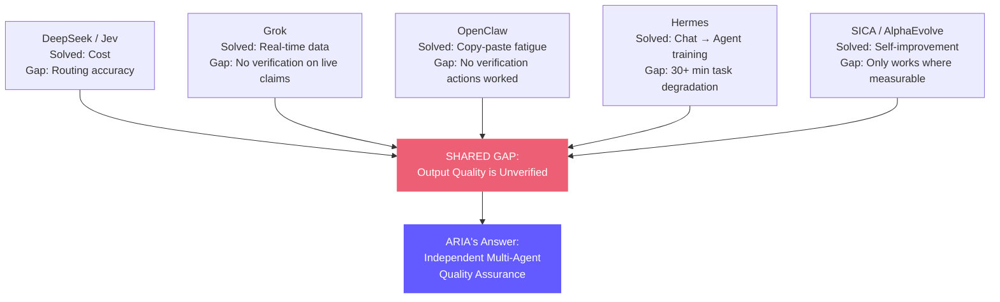

# ARIA Core Thesis

> **"You wouldn't let a junior developer ship code without code review. Why do you let AI do it?"**

---

## The Problem Nobody Has Solved

Every recent AI breakthrough — DeepSeek, Grok, OpenClaw, Hermes — solved a different problem but shares ONE blind spot:

**You cannot tell if your AI agent's output is correct.**

| Stat | Value |
|------|-------|
| Teams with agent observability (uptime, logs) | 89% |
| Teams with actual output evaluation | 52% |
| **The gap where agents fail silently** | **37 points** |
| Enterprise AI agent pilots that reach production | 11-14% |

A healthy server can produce terrible output. Latency looks fine while the agent hallucinates. Infrastructure uptime tells you nothing about output quality.

## What Each Breakthrough Solved (And What's Still Broken)

## ARIA's Answer

> ARIA is the only AI platform where output quality is **independently verified, measured, and guaranteed** — not by the builder, but by a separate verification system that never saw the builder's reasoning.

### Why It's Hard to Copy

1. **Requires multi-agent architecture** — single-agent tools (Cursor, Replit, Lovable) structurally can't do independent review
2. **Requires domain-specific verification** — our tiered Sentinel with role-specific prompts for each employee type
3. **Compounds over time** — every execution generates verification data that improves future verification
4. **Cost-optimized** — Jev layer makes verification cheap enough to run on every output

### What's Already Built

| Component | What It Does |
|-----------|-------------|
| [[Multi-Tier Sentinel]] | 3-tier fail-fast verification (Structural → Deep → Domain) |
| [[Jev Decision Layer]] | Cheap model (Lightning 30B) for QA triage, expensive (Super 120B) for creative work |
| [[Execution Policies]] | Role-specific state machines — each role verified differently |
| [[Cost Tracking]] | Prove verification is worth the cost per execution |

### What's Coming (Locked)

| Feature | Description |
|---------|-------------|
| **Verification Proof Engine** | Quantifiable scorecards: what Sentinel caught vs what would have shipped |
| **Side-by-Side Demo** | Same goal through single-agent vs ARIA pipeline — show the quality delta |
| **Quality Dashboard** | Aggregate verification data across all executions |
| **AI CEO Briefing** | Opinionated strategic summary from your AI company's leadership |
| **Employee Debate** | Structured disagreement between agents for better decisions |
| **Execution Replay** | DVR for AI reasoning with fork-from-any-point |

## The Positioning Statement

**Old (hackathon):** "We have 6 AI agents that build software together."
**New (thesis):** "We're the only platform that guarantees AI output quality through independent multi-agent verification."

The first invites the question: "Why pay for 6 agents when one works?"
The second is undeniable: nobody can argue that self-review beats independent review.

---

## Evolution: AI Action Infrastructure

This thesis remains valid but is now **one layer** of a larger strategic framework. The deep thesis shifts ARIA from "AI software company" to "AI Action Infrastructure" — a model-agnostic reliability runtime where the fundamental object is ACTION with intent, authority, preconditions, evidence, verification, commit, rollback, and audit.

See [[Deep Thesis — AI Action Infrastructure]] for the full framework.

---

Related: [[Deep Thesis — AI Action Infrastructure]], [[Project Vision]], [[Roadmap]], [[Six Agent Architecture]], [[AI Agent Market - Competitors]]

#thesis #strategy #locked
