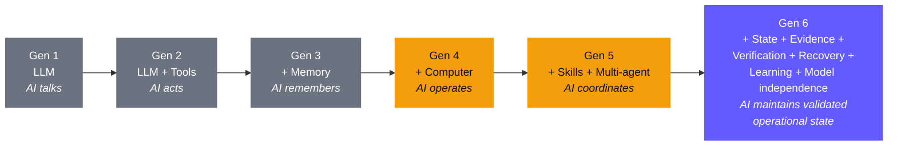

# Deep Thesis — AI Action Infrastructure

> **We are not building an AI agent. We are building the infrastructure that every future autonomous AI system needs to be reliable.**

---

## The Problem

Current AI is getting good at: `Prompt → Reasoning → Tool → Result`

Real-world work looks like:

```
Goal
 ↓ Interpret what "done" actually means
 ↓ Plan
 ↓ Act
 ↓ Observe
 ↓ Detect whether reality changed as expected
 ↓ Verify
 ↓ Remember what happened
 ↓ Recover if something went wrong
 ↓ Re-plan
 ↓ Act again
 ↓ Handle external changes
 ↓ Continue tomorrow
 ↓ Know when NOT to act
 ↓ Eventually produce a trustworthy outcome
```

Current agents are fragile across that entire loop. This is **measurable**:
- STATE-Bench (2026): agents with strong single-run performance are unreliable across repeated runs
- Long-horizon studies: success drops dramatically as dependent steps increase (driven by step count, not context length)
- Enterprise reality: 86-89% of AI agent pilots never reach production

---

## The Landscape — 6 Generations of AI



**Gen 4-5 = where Grok Bot, OpenClaw, Hermes live.**
**Gen 6 = the territory we're investigating.**

---

## What Each System Is Actually Attacking

| System | Attack Vector | Missing Primitive |
|--------|--------------|-------------------|
| **Jev / DeepSeek** | Cheap calibrated decisions inside the agent loop | Decision-making layer |
| **Grok Bot** | Persistent execution — computers, filesystem, browser, memory | Persistent runtime |
| **OpenClaw** | Agent operating environment — tools, skills, plugins, sub-agents | Extensibility layer |
| **Hermes** | Experience → skill → future improvement | Learning layer |

**They still don't solve the entire problem.** Every one shares the same blind spot: the agent can act, but can't prove its actions produced the intended state change.

---

## The 5 Fundamental Gaps

| Gap | What We Have | What We Need |
|-----|-------------|-------------|
| **State Truth** | Memory tells what was remembered | What is *currently true*? |
| **Action Truth** | Agent says "Done" | What *evidence proves* done? |
| **Causal History** | Something changed | *Why* did it change, which action caused it? |
| **Recovery** | `retry()` | Where can we *safely resume* from verified state? |
| **Cross-Agent Trust** | A delegates to B delegates to C | Who authorized what, based on which evidence? |

---

## The Architecture

```
                    ┌──────────────────────┐
                    │       USER GOAL      │
                    └──────────┬───────────┘
                               ↓
                    ┌──────────────────────┐
                    │    GOAL COMPILER      │
                    │ What does "done" mean?│
                    └──────────┬───────────┘
                               ↓
                    ┌──────────────────────┐
                    │   WORLD STATE GRAPH   │
                    │ facts / claims /      │
                    │ evidence / changes    │
                    └──────────┬───────────┘
                               ↓
                    ┌──────────────────────┐
                    │    DECISION ENGINE    │
                    │ Jev-like primitive    │
                    └──────────┬───────────┘
                               ↓
                    ┌──────────────────────┐
                    │   EXECUTION ENGINE    │
                    │ tools / browser / VM  │
                    └──────────┬───────────┘
                               ↓
                    ┌──────────────────────┐
                    │      OBSERVER         │
                    │ what actually happened│
                    └──────────┬───────────┘
                               ↓
                    ┌──────────────────────┐
                    │      VERIFIER         │
                    │ did it really work?  │
                    └──────────┬───────────┘
                         ┌─────┴─────┐
                         ↓           ↓
                      COMMIT       RECOVER
                         │           │
                         └─────┬─────┘
                               ↓
                         WORLD STATE
                         (loop continues)
```

---

## The "Commit" Primitive

Most agents: `result = tool(); memory.save(result)`

Our runtime requires:

```
proposal → preconditions → permission → execution → observation → verification → COMMIT
```

**Example:** Agent says "I deployed the application."

Runtime requires evidence:
- ✓ deployment command completed
- ✓ process running
- ✓ health endpoint = 200
- ✓ expected version = 1.8.4
- ✓ database migration = successful
- ✓ smoke test = passed

Only then: `STATE := DEPLOYED(version=1.8.4)`
Otherwise: `STATE := DEPLOYMENT_UNVERIFIED`

---

## The AI Action Ledger

Every meaningful agent action produces a causal record:

```
ACTION:          Deploy v1.8.4
JUSTIFICATION:   Requirement R-143
PRECONDITIONS:   ✓ tests passed, ✓ migration available, ✓ approval received
EVIDENCE:        commit abc123, CI run #1921, approval #A82
EFFECTS:         service version changed, database schema changed
POSTCONDITIONS:  ✓ health check, ✓ smoke test
CONFIDENCE:      0.98
REVERSIBILITY:   YES
DEPENDENCIES INVALIDATED: cache state, old deployment assumptions
```

---

## The Moat

The runtime itself is copyable. What **accumulates**:

1. **Operational intelligence** — millions of state transitions, trajectories, failure patterns
2. **Recovery policies** — failure → diagnosis → recovery strategy library
3. **Failure intelligence** — "agents fail this class of task in these 37 ways"
4. **Adaptive model routing** — capability-based, not brand-based
5. **Outcome feedback** — learning from what actually happened in the world

**The killer test:**
- "If OpenAI released a 10x smarter model tomorrow, would our product become irrelevant?" → If yes, don't build it.
- "If ALL models became 10x smarter, would our system become MORE valuable?" → If yes, now we're interested.

Better models make our runtime MORE capable. We're not betting on which model wins — we're betting on what every model still needs.

---

## 16 Investigation Buckets

| # | Frontier | Core Question |
|---|----------|--------------|
| 1 | Model routing | Which model for each cognitive operation? |
| 2 | Decision models | Can small models control expensive agents? |
| 3 | Memory | How should agents remember? |
| 4 | **State** | **What is actually true right now?** |
| 5 | Planning | How do plans survive changing reality? |
| 6 | **Execution** | **How do actions become reliable?** |
| 7 | **Verification** | **How do we prove an action succeeded?** |
| 8 | **Recovery** | **How does an agent recover safely?** |
| 9 | Learning | How does experience become capability? |
| 10 | Multi-agent | How do independent agents coordinate reliably? |
| 11 | Security | How do we prevent agents from being hijacked? |
| 12 | Computer use | How does AI safely control interfaces? |
| 13 | Deep research | How does AI establish trustworthy claims? |
| 14 | Physical AI | How do AI actions interact with reality? |
| 15 | Interoperability | How do agents/models/tools work across vendors? |
| 16 | Economic agency | Identity, authority, budget, payment, audit |

Bold = our highest-priority investigation areas.

---

## Research Priority Tiers

### Tier: Unusually Interesting Problems

| ID | Problem | Description |
|----|---------|-------------|
| A | **State-aware runtime** | truth, state, evidence, commit, rollback, recovery |
| B | **Agent action ledger** | intent, authority, action, consequence, evidence, causality |
| C | **Agent recovery engine** | failure, diagnosis, checkpoint, compensation, resume |
| D | **Experience → skill compiler** | trajectory → failure → procedure → test → reusable skill |
| E | **Cross-agent trust layer** | proof and accountability across delegation chains |
| F | **Claim/evidence engine** | claim → evidence → contradiction → temporal validity |
| G | **Agent security runtime** | identity, permissions, memory/tool/data isolation |

---

## The Hidden Landscape

### Memory Layer
Letta/MemGPT, Mem0, Zep/Graphiti, Cognee, LangMem, Supermemory — all different approaches, but **memory ≠ truth**. A state-validity engine is substantially more interesting.

### Computer Use
Browserbase, Stagehand, OSWorld, WebArena — the agent can control the computer but doesn't understand the **consequences** of controlling it.

### Sandboxes
E2B, Daytona, Modal, Cloudflare — sandbox ≠ safety. A sandbox prevents host damage but doesn't prevent logically wrong but technically permitted actions.

### Protocols
MCP (tools), A2A (agent-to-agent), AG-UI (agent-to-UI), UCP (commerce), AP2 (payments) — interoperability is becoming infrastructure, but **who owns the truth** when Agent A delegates to B to C?

### Observability
Langfuse, Braintrust, Arize Phoenix — track what happened, but not **why** the agent made that decision or **where** the trajectory first became unrecoverably wrong.

### Security
Memory itself can become an attack surface. A website injects malicious instruction → agent reads it → stores as memory → returns tomorrow → memory influences future decisions. The attack crosses sessions.

---

## Research-First Approach

> [!decision] DO NOT CODE YET
> Phase 1 is Agent Autopsy — study 30-50 systems. For each:
> 1. What does it solve?
> 2. How does it solve it?
> 3. Where does it fail?
> 4. What assumption does it make?
> 5. What happens when that assumption breaks?
> 6. Who solves that failure?
> 7. If nobody → is that a real business?

**Warning:** A 2026 paper already proposes a "State-Aware Runtime" close to our architecture. Don't build what's being commoditized. Study it, then ask: **what does even a state-aware runtime still fail to understand?**

Current candidates for the next primitive: **causality → accountability → recoverability → learned recovery → cross-agent trust.**

---

## Connection to ARIA

ARIA's existing components become research primitives:

| ARIA Component | Maps To |
|---------------|---------|
| Goal Engine | Goal Compiler |
| Task Graph | Planning with invariants |
| Durable Execution Worker | Reliable action execution |
| Multi-Tier Sentinel | Independent verification |
| Jev Decision Layer | Decision engine |
| Memory Engine | State truth (needs upgrade) |
| Execution Policies | Recovery policies (needs upgrade) |

ARIA is the experimental laboratory. The deep thesis is the product.

---

Related: [[Core Thesis]], [[Roadmap]], [[Project Vision]]

#thesis #strategy #locked #research
