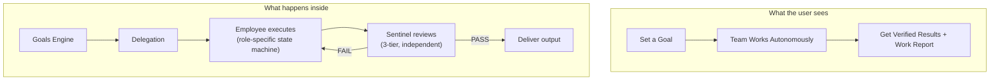

# Project Vision

## The Problem (Original)

I love hackathons but I'm always solo. Finding teammates is painful — begging, coordinating, depending on unreliable people. I don't want to find team members. I want to **build** them.

## The Evolution

What started as a hackathon tool became something bigger:

| Phase | Vision | Status |
|-------|--------|--------|
| V1 (Aug 2026) | AI hackathon teammates — paste problem, get product | Done |
| V2 (Sep 2026) | Persistent AI employees with identity, memory, skills | Done |
| V3 (Sep 2026) | Autonomous execution with independent verification | Done |
| V4 (Current) | **Quality Guarantee Platform** — the thesis | In Progress |
| V5 (Future) | Organizational intelligence — self-improving AI company | Vision |

## The Thesis (V4)

> **"You wouldn't let a junior developer ship code without code review. Why do you let AI do it?"**

Every AI tool today has the builder grading its own exam. ARIA is the only platform with **independent multi-agent verification** that catches what single-agent systems miss.

See [[Core Thesis]] for the full strategic argument.

## Core Philosophy

- **Independent verification** — builder never grades its own work
- **6 agents, never fewer** — separation of concerns IS the value
- **Quality over speed** — we're not the fastest, we're the most reliable
- **Human leads, AI executes** — approval gates, review points, steering
- **Build for yourself** — this is your tool, not a demo

## The Current System

## Design Principles

1. **Don't consolidate agent roles** — the separation IS the value
2. **Independent verification is non-negotiable** — no self-grading
3. **Quality over quantity** — each output should be directly usable
4. **Build for yourself first** — not for judges, not for investors
5. **Cost-aware** — Jev layer proves cheap verification beats expensive single-shot

---

Related: [[Core Thesis]], [[Roadmap]], [[How It Works]], [[Agent Roster]]

#vision #strategy
