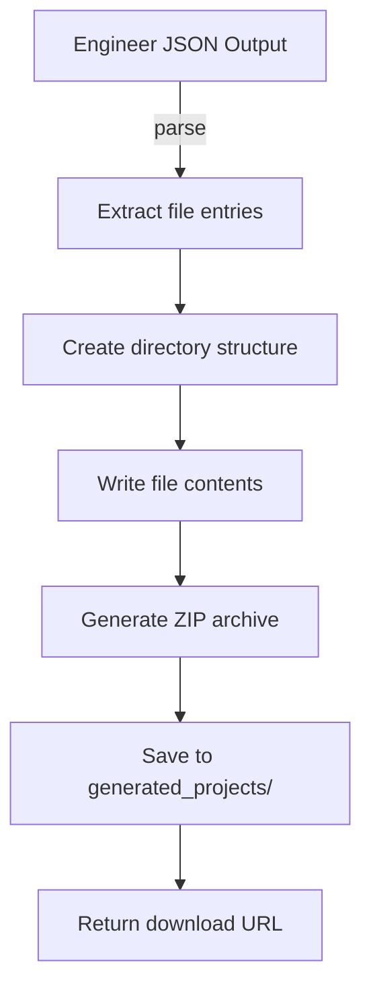

# File Generator

The file generation system converts raw agent output (JSON with embedded code) into real, downloadable files — ZIP archives, PowerPoint presentations, and Word documents.

## Overview

> [!code] Three Generators, One Goal
> The [[Engineer Agent]] outputs JSON containing complete file contents. The [[PPT Agent]] outputs JSON containing slide content. Three generators turn this structured data into real deliverables:
>
> | Generator | Input | Output | Library |
> |-----------|-------|--------|---------|
> | `file_generator.py` | Engineer's code JSON | `.zip` archive | Python stdlib (zipfile) |
> | `pptx_generator.py` | PPT Agent's slide JSON | `.pptx` file | python-pptx |
> | `docx_generator.py` | All agent outputs | `.docx` report | python-docx |

## file_generator.py — Code to ZIP

The primary generator. Takes the Engineer's JSON output and creates a directory structure with real files.

### Process



### What It Handles

| Step | Details |
|------|---------|
| **JSON Parsing** | Extracts `files` array from Engineer's output. Each entry has `path` and `content`. |
| **Directory Creation** | Creates nested folders matching the file paths (e.g., `src/components/Header.tsx`) |
| **File Writing** | Writes each file's content to disk with correct encoding |
| **ZIP Packaging** | Compresses the entire project directory into a single `.zip` |
| **Storage** | Saves to `generated_projects/{project_id}/` on the local filesystem |
| **Cleanup** | Removes temporary directory after ZIP is created |

### Edge Cases

- **Malformed JSON**: If the Engineer's output has broken JSON, the generator attempts recovery (finding the `files` array boundary)
- **Path traversal**: File paths are sanitized to prevent `../` attacks
- **Empty files**: Skipped silently
- **Duplicate paths**: Later entries overwrite earlier ones

## pptx_generator.py — Slides to PowerPoint

Converts the [[PPT Agent]]'s slide content into a real `.pptx` file using `python-pptx`.

### Slide Generation

| Slide Type | Layout | Content |
|------------|--------|---------|
| Title slide | Title + subtitle | Project name, tagline |
| Problem | Title + body | Problem statement, impact |
| Solution | Title + bullets | Solution overview, approach |
| Features | Title + bullets | Key features list |
| Architecture | Title + body | Technical approach (simplified) |
| Market | Title + bullets | Competitors, gaps |
| Impact | Title + bullets | Expected outcomes, metrics |
| Roadmap | Title + bullets | Future plans |
| Team | Title + body | Team composition |

### Formatting

- Consistent font sizes: title 32pt, subtitle 20pt, body 16pt
- Bullet points for lists
- Professional color scheme (white background, dark text)
- Slide dimensions: standard 16:9

## docx_generator.py — All Outputs to Report

Generates a comprehensive Word document that compiles outputs from all agents into a single report.

### Document Sections

1. **Title Page** — project name, date, team
2. **Executive Summary** — from CEO brief
3. **Requirements** — from BA output
4. **Market Research** — from Researcher output
5. **Technical Architecture** — from Architect output
6. **Implementation Notes** — from Engineer output (file list, not full code)
7. **Presentation Summary** — from PPT output

### Formatting

- Table of contents (auto-generated)
- Heading styles (Heading 1-3)
- Tables for structured data
- Page numbers in footer

## File Storage

All generated files are stored locally:

```
generated_projects/
├── {project_id}/
│   ├── project/           # Extracted files (temporary)
│   ├── project.zip        # Code archive
│   ├── presentation.pptx  # PowerPoint file
│   └── report.docx        # Word document
```

The [[Frontend Dashboard]] provides download buttons for each file type. In [[V2 Vision|V2]], generated projects may be pushed directly to [[GitHub Integration|GitHub]].

## Key Files

- `backend/app/services/file_generator.py` — Code extraction + ZIP
- `backend/app/services/pptx_generator.py` — PowerPoint generation
- `backend/app/services/docx_generator.py` — Word document generation

---

Related: [[Engineer Agent]], [[PPT Agent]], [[Tech Stack]], [[Frontend Dashboard]], [[Pipeline Flow]]

#architecture #file-generation #deliverables
