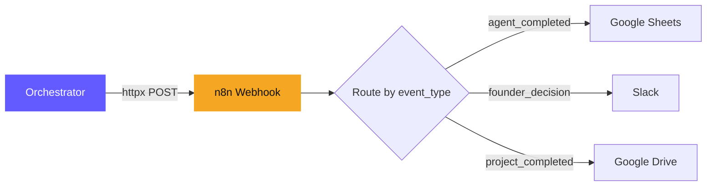

# Orchestrator

**File:** `backend/app/services/orchestrator.py`

The orchestrator is the brain of the pipeline. It manages the sequential flow of agents, approval gates, cross-reviews, webhook events, and real-time notifications.

## Flow

```
start_project(problem_statement)
  ├── Create project in DB
  ├── Run CEO agent (auto-approved)
  ├── Cross-review: CEO output reviewed by BA model
  ├── Save CEO output to memory
  ├── Send webhook: agent_completed (CEO)
  ├── Notify via WebSocket: "CEO completed"
  └── Start Business Analyst

_start_next_agent(project_id, role)
  ├── Update project status to "working"
  ├── Notify: "Agent started"
  ├── Run agent (async task)
  ├── On completion:
  │   ├── Cross-review: previous agent reviews this output
  │   ├── Send webhook: agent_completed
  │   ├── If has approval gate → status = "review", notify "approval needed"
  │   ├── If Researcher → send webhook: research_completed
  │   └── If PPT (final):
  │       ├── Generate .pptx (presentation)
  │       ├── Generate .docx (documentation)
  │       ├── Send webhook: project_completed
  │       └── status = "completed"
  └── On error → notify error

handle_approval(project_id, output_id, approved, feedback)
  ├── Send webhook: founder_decision
  ├── If approved:
  │   ├── Mark output as "approved"
  │   ├── If Engineer approved → generate project .zip files
  │   ├── Start next agent in pipeline
  │   └── Notify: "Moving to next agent"
  └── If rejected:
      ├── Mark output as "rejected"
      ├── Save feedback to shared memory
      ├── Restart same agent (will see feedback)
      └── Notify: "Revision requested"
```

## Cross-Review System

After each agent completes, the **previous agent's model** reviews the output for consistency and quality. See [[Cross Review System]] for the full design rationale.

| Agent Output | Reviewed By | Check |
|--------------|-------------|-------|
| CEO | (none — first agent) | — |
| Business Analyst | CEO model | Do requirements match the brief? |
| Researcher | BA model | Does research cover all requirements? |
| Architect | Researcher model | Is the tech spec grounded in research? |
| Engineer | Architect model | Does code match the technical spec? |
| PPT | (none — presentation only) | — |

Cross-reviews use **free models** (same as the reviewing agent) and add minimal cost. See [[Model Strategy]].

## Webhook Events

The orchestrator calls the webhook service at key pipeline stages. Events are sent to the [[n8n Integration]] instance.

| Function | Event Type | When |
|----------|------------|------|
| `send_agent_event()` | `agent_completed` | Any agent finishes |
| `send_research_data()` | `research_completed` | Researcher returns search results |
| `send_approval_event()` | `founder_decision` | Founder approves or rejects |
| `send_deliverables_ready()` | `project_completed` | All deliverables generated |

**Webhook service file:** `backend/app/services/webhook.py` (uses `httpx` async client)

## File Generation Triggers

| Event | Action |
|-------|--------|
| Engineer output approved | `generate_project_files()` -> creates `.zip` |
| PPT agent completes | `generate_pptx()` -> creates `.pptx` |
| PPT agent completes | `generate_docx()` -> creates `.docx` |

## DOCX Generation

After the PPT agent completes, the orchestrator also triggers DOCX generation via `backend/app/services/docx_generator.py`. The DOCX includes:
- Project overview (from CEO brief)
- Requirements (from BA)
- Research findings (from Researcher)
- Technical architecture (from Architect)
- Implementation notes (from Engineer)

## WebSocket Events

| Event Type | When |
|------------|------|
| `agent_started` | Agent begins working |
| `agent_completed` | Agent finishes (CEO only — others go to review) |
| `cross_review_completed` | Cross-review finished |
| `approval_needed` | Agent output ready for founder review |
| `approval_accepted` | Founder approved, moving to next |
| `revision_requested` | Founder rejected, agent reworking |
| `files_generated` | Project code .zip created |
| `pptx_generated` | Presentation .pptx created |
| `docx_generated` | Documentation .docx created |
| `project_completed` | All agents done |
| `error` | Something went wrong |

## n8n Integration Flow



---

Related: [[How It Works]], [[API Reference]], [[Cross Review System]], [[n8n Integration]], [[Model Strategy]]

#architecture #orchestrator
