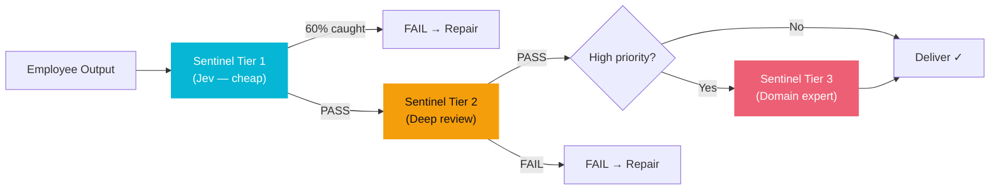

# Agent Roster

## Current: Persistent AI Employees (V3)

| Name | Role | Execution Phases | Sentinel Tier 3 Focus |
|------|------|-----------------|----------------------|
| **Sage** | Business Analyst | 6: Plan → Analyze → Structure → Review → QA → Deliver | Testable requirements, acceptance criteria |
| **Scout** | Researcher | 6: Plan → Research → Analyze → Synthesize → QA → Deliver | Source credibility, evidence quality |
| **Arc** | Architect | 6: Plan → Design → Evaluate → Refine → QA → Deliver | Scalability, single points of failure |
| **Atlas** | Software Engineer | 8: Plan → Implement → Execute → Observe → Repair → Test → QA → Deliver | Production resilience, dependency management |
| **Sentinel** | QA Engineer | 7: Plan → Analyze → Test → Report → QA → Deliver | Test coverage, flaky test indicators |
| **Scribe** | Technical Writer | 6: Plan → Research → Write → Review → QA → Deliver | Developer-followable docs, code examples |

## How Employees Work

### Chat Mode
Direct conversation with any employee. They have memory (5 types), skills (learned from past work), and tool access (code execution, web search, delegation).

### Autonomous Mode
1. User sets a **goal** (via Goals Engine or direct)
2. **Delegation Worker** assigns employee
3. **Execution Controller** runs role-specific state machine
4. Employee works through phases autonomously
5. At **QA phase**, [[Multi-Tier Sentinel|Sentinel]] independently verifies output
6. On **FAIL**, issues sent back → REPAIRING phase → re-verify
7. On **PASS**, output delivered + [[Jev Decision Layer|cost tracked]]

### Verification Flow

## Legacy: Pipeline Agents (V1)

The original 6-agent pipeline still exists for quick project generation:

| Agent | Role | Approval Gate |
|-------|------|--------------|
| CEO | Project Manager + Classifier | No (auto) |
| RAG Agent | Workflow Search | No (auto) |
| Business Analyst | Requirements | Yes |
| Researcher | Market Research | Yes |
| Architect | Technical Design | Yes |
| Engineer | Implementation | Yes |
| PPT | Presentation | No (auto) |

See individual agent pages: [[CEO Agent]], [[Business Analyst Agent]], [[Researcher Agent]], [[Architect Agent]], [[Engineer Agent]], [[PPT Agent]], [[RAG Workflow Agent]]

---

Related: [[Core Thesis]], [[Multi-Tier Sentinel]], [[Execution Policies]], [[Jev Decision Layer]]

#agents #employees #roster
