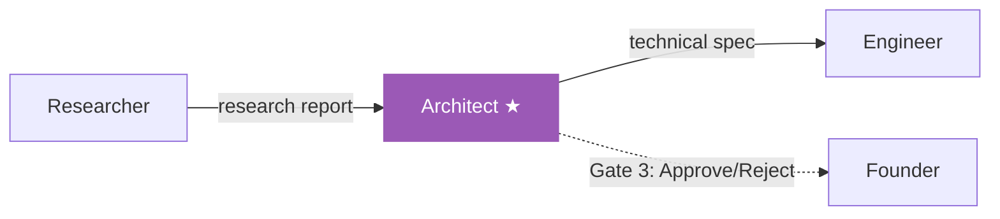

# Architect Agent

The Architect is the **fourth agent** in the pipeline. It takes the accumulated context — CEO brief, BA requirements, and research findings — and produces a detailed technical specification that the [[Engineer Agent]] will implement.

## Role

> [!agent] Software Architect
> **Mission:** Design a complete technical blueprint that an Engineer can implement without guessing.
>
> The Architect makes all the hard technical decisions: framework choices, database design, API structure, file organization, and deployment strategy. A good technical spec means the Engineer can focus on writing code instead of making design decisions mid-generation.

## Pipeline Position

**Position:** 4th of 6 agents
**Approval Gate:** Yes (Gate 3)
**Reviewed by:** [[Researcher Agent]] (cross-review — "Are tech choices supported by my research?")
**Reviews:** [[Engineer Agent]] output (cross-review — "Does the code follow my architecture?")

## Input

| Field | Details |
|-------|---------|
| **Source** | All 3 previous agents via shared memory |
| **Format** | CEO brief + BA requirements + Research report |
| **Key fields used** | BA's `functional_requirements`, Research's `technology_recommendations`, CEO's `tech_suggestions` |
| **Context size** | Second-largest (everything before Engineer) |

## Output

The Architect produces a **technical specification JSON** with:

| Field | Description |
|-------|-------------|
| `architecture_overview` | High-level system design and patterns |
| `tech_stack` | Specific frameworks, libraries, and versions |
| `file_structure` | Complete directory tree with file descriptions |
| `database_design` | Tables, relationships, and key queries |
| `api_design` | Endpoints, methods, request/response formats |
| `component_design` | Frontend component hierarchy and data flow |
| `deployment_strategy` | How to run the project (for hackathon demo) |
| `trade_offs` | What was chosen and what was explicitly rejected, with reasoning |

## Model

> [!decision] Model Choice
> | Setting | Value |
> |---------|-------|
> | **Recommended** | DeepSeek V3 |
> | **Cost** | Free (via OpenRouter, 0217 snapshot) |
> | **Why DeepSeek?** | Technical specification requires stronger reasoning than simple extraction. DeepSeek V3 excels at structured technical output and architectural thinking. |
> | **Why not paid?** | The spec is a blueprint, not the final product. Even if imperfect, the Engineer (using Claude Sonnet 4) can adapt. |

See [[Model Strategy]] for the full cost analysis and [[Model Selection History]] for why DeepSeek V3 was chosen.

## Performance

| Metric | Value |
|--------|-------|
| **Average time** | ~15s (DeepSeek V3 is fast) |
| **Test run time** | 5s (fastest agent in the pipeline) |
| **Token output** | ~1500-2500 tokens |
| **Failure rate** | Very low — DeepSeek V3 is consistent |

> [!status] Fastest Agent
> At 5s in testing, the Architect is the fastest agent in the pipeline. DeepSeek V3's speed + the structured nature of the task means this step rarely bottlenecks.

## The Architect-Engineer Handoff

The quality of the Architect's output directly determines how well the [[Engineer Agent]] performs:

| Architect Quality | Engineer Impact |
|-------------------|-----------------|
| **Clear file structure** | Engineer generates correct files with correct imports |
| **Specific frameworks** | Engineer uses the right packages, no guessing |
| **Detailed API design** | Engineer implements working endpoints |
| **Vague spec** | Engineer hallucinates structure, higher failure rate |

This is why the Architect uses DeepSeek V3 (stronger reasoning) while simpler agents use Gemma 4 31B. See [[Six Agent Architecture]] for why this separation matters.

## Key Files

- **Prompt:** `backend/app/agents/prompts.py` (Architect system prompt)
- **Execution:** `backend/app/agents/engine.py` (agent runner)
- **Orchestrator call:** `backend/app/services/orchestrator.py`

---

Related: [[Agent Roster]], [[Researcher Agent]], [[Engineer Agent]], [[Model Strategy]], [[Six Agent Architecture]], [[Pipeline Flow]]

#agent #architect #technical-design
