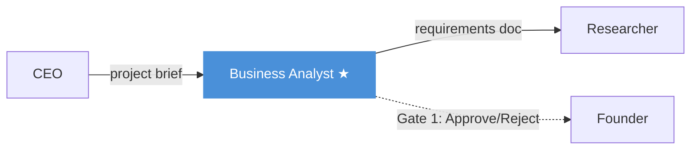

# Business Analyst Agent

The Business Analyst is the **second agent** in the pipeline. It takes the CEO's project brief and extracts structured requirements — user stories, feature lists, scope boundaries, and acceptance criteria.

## Role

> [!agent] Business Analyst
> **Mission:** Transform the CEO's high-level project brief into detailed, actionable requirements.
>
> The BA thinks like a product manager. Given a brief that says "smart waste management system," the BA produces user stories, prioritized feature lists, scope boundaries (what's in vs. out for a hackathon MVP), and clear acceptance criteria. This is the foundation that every downstream agent builds on.

## Pipeline Position

**Position:** 2nd of 6 agents
**Approval Gate:** Yes (Gate 1 — first approval the Founder makes)
**Reviewed by:** [[CEO Agent]] (cross-review — "Does this match my brief?")
**Reviews:** [[Researcher Agent]] output (cross-review)

## Input

| Field | Details |
|-------|---------|
| **Source** | [[CEO Agent]] via shared memory |
| **Format** | CEO's project brief JSON (8 fields) |
| **Key fields used** | `problem_summary`, `core_features`, `target_users`, `scope` |
| **Context** | Also receives the original problem statement for reference |

## Output

The BA produces a **requirements document JSON** with:

| Field | Description |
|-------|-------------|
| `functional_requirements` | What the system must do (4-8 items) |
| `non_functional_requirements` | Performance, security, scalability constraints |
| `user_stories` | "As a [user], I want [feature], so that [benefit]" |
| `feature_priority` | MoSCoW: Must have, Should have, Could have, Won't have |
| `scope_boundaries` | Explicitly what is IN and OUT of scope |
| `acceptance_criteria` | How to verify each major feature works |
| `assumptions` | What the BA assumed from the short problem statement |
| `risks` | Requirements-level risks and mitigations |

## Model

> [!decision] Model Choice
> | Setting | Value |
> |---------|-------|
> | **Recommended** | Gemma 4 31B |
> | **Cost** | Free (via OpenRouter) |
> | **Why free?** | Requirements extraction is structured and rule-based. The CEO brief provides enough context that free models produce reliable requirements. |
> | **Alternative** | Any instruction-following model with 30B+ params |

See [[Model Strategy]] for the full cost analysis.

## Performance

| Metric | Value |
|--------|-------|
| **Average time** | ~40s (with fast model) |
| **Test run time** | 125s (with Nemotron 120B) |
| **Token output** | ~800-1200 tokens |
| **Failure rate** | Low — well-structured input from CEO |

## Gate 1 — The First Decision

> [!pipeline] Why This Gate Matters
> Gate 1 is the **first time the Founder intervenes**. If bad requirements slip through, every downstream agent builds on a flawed foundation. The [[Cross Review System]] helps — the CEO reviews the BA's output before the Founder even sees it — but ultimately the Founder decides.
>
> **On rejection:** The BA receives the Founder's feedback, sees what was wrong, and regenerates. The feedback is stored in shared memory so the BA can course-correct.

See [[Approval Gate Design]] for the full gate architecture.

## Key Files

- **Prompt:** `backend/app/agents/prompts.py` (BA system prompt)
- **Execution:** `backend/app/agents/engine.py` (agent runner)
- **Orchestrator call:** `backend/app/services/orchestrator.py`

---

Related: [[Agent Roster]], [[CEO Agent]], [[Researcher Agent]], [[Cross Review System]], [[Approval Gate Design]], [[Model Strategy]]

#agent #business-analyst
