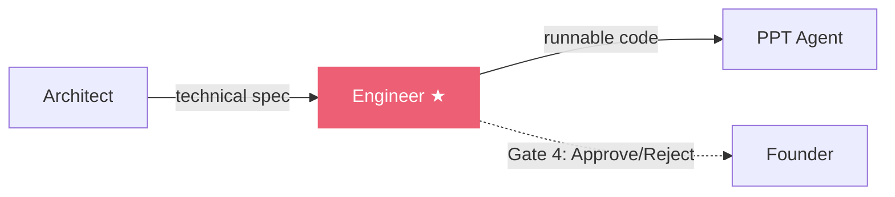

# Engineer Agent

The Engineer is the **most critical agent** in the pipeline. It takes all previous outputs — project brief, requirements, research, and technical spec — and generates a complete, runnable software project.

## Role

> [!agent] Software Engineer
> **Mission:** Generate production-quality, runnable code for the entire project.
>
> This is where the magic happens. The Engineer produces a complete codebase — frontend, backend, configuration files, and documentation — that can be zipped and deployed. Code quality here directly determines the quality of the final deliverable.

## Pipeline Position

**Position:** 5th of 6 agents
**Approval Gate:** Yes (Gate 4 — Founder reviews generated code)
**Reviewed by:** [[Agent Roster|Architect]] (cross-review)
**Reviews:** None (final code agent)

## Input

| Field | Details |
|-------|---------|
| **Source** | All 4 previous agents via shared memory |
| **Context size** | Largest of any agent (accumulates all prior outputs) |
| **Key inputs** | Architect's technical spec (primary), BA requirements, research data |
| **Format** | Shared memory JSON — all previous outputs concatenated |

## Output

| Field | Details |
|-------|---------|
| **Format** | Complete project code as structured JSON |
| **Max tokens** | ~16,000 tokens |
| **Contains** | Multiple files: HTML, CSS, JS/TS, Python, configs, README |
| **Generated from** | Architect's file structure + feature requirements |
| **Post-processing** | `file_generator.py` extracts files into a directory, zips them |

## Model

> [!decision] Model Choice — This One Matters
> | Setting | Value |
> |---------|-------|
> | **Recommended** | Claude Sonnet 4 |
> | **Cost** | ~$0.25 per run |
> | **Why paid?** | Code generation is the ONE task where quality = product quality. No free model matches Claude Sonnet 4 for multi-file code generation. |
> | **Alternative** | DeepSeek V3 (free, but noticeably lower code quality) |
> | **Never use** | Small models (< 30B params) — they cannot maintain coherent multi-file projects |

> [!status] Cost Justification
> The Engineer is the only paid agent in the pipeline. At ~$0.25/run, with a $10 budget you get 38+ complete projects. The ROI is enormous — you get a runnable codebase for the price of a single API call.

See [[Model Strategy]] for the full cost analysis.

## Performance

| Metric | Value |
|--------|-------|
| **Average time** | 2-5 minutes |
| **Test run time** | 400s+ (with Nemotron 120B) |
| **Token output** | 10,000-16,000 tokens |
| **Failure rate** | Moderate — long generation can timeout |
| **Retry strategy** | On failure, feedback is saved to memory and agent retries |

## Call Employee (Pair Programming)

The Engineer has a special **iteration mode** in the Call Employee feature:
- Founder can chat directly with the Engineer after initial generation
- Engineer can modify individual files based on feedback
- Changes are applied to the generated project
- No need to re-run the entire pipeline for small fixes

## Level 4 Upgrade (V1.5)

> [!pipeline] Planned: Level 4 Engineer
> The next major upgrade turns the Engineer into a **Level 4 agent** that can:
> - Push generated code directly to GitHub (auto-create repo)
> - Trigger Vercel deployment (auto-deploy)
> - Return a live URL instead of a ZIP file
> - Interactive build: founder watches code appear in real-time
>
> See [[Roadmap]] and [[GitHub Integration]] for details.

## Key Files

- **Prompt:** `backend/app/agents/prompts.py` (Engineer system prompt)
- **Execution:** `backend/app/agents/engine.py` (agent runner)
- **File generation:** `backend/app/services/file_generator.py` (code to ZIP)
- **Orchestrator call:** `backend/app/services/orchestrator.py`

---

Related: [[Agent Roster]], [[Orchestrator]], [[Model Strategy]], [[CEO Agent]], [[GitHub Integration]], [[Roadmap]]

#agent #engineer #critical
