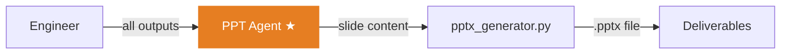

# PPT Agent

The PPT Agent is the **sixth and final agent** in the pipeline. It takes all previous outputs and generates presentation slide content that gets converted into a real PowerPoint file.

## Role

> [!agent] Presentation Specialist
> **Mission:** Create compelling slide content that tells the project's story from problem to solution.
>
> The PPT Agent synthesizes everything — the CEO's vision, the BA's requirements, the Researcher's market data, the Architect's technical design, and the Engineer's implementation — into a cohesive narrative suitable for a [[SIH Context|hackathon presentation]]. It does not create visual slides directly; it produces structured JSON that [[File Generator|pptx_generator.py]] converts into a `.pptx` file.

## Pipeline Position



**Position:** 6th of 6 agents (final)
**Approval Gate:** None (auto-complete — the pipeline is done)
**Reviewed by:** [[CEO Agent]] (cross-review — "Does this presentation match my project vision?")
**Reviews:** None (last agent)

## Input

| Field | Details |
|-------|---------|
| **Source** | All 5 previous agents via shared memory |
| **Format** | Complete pipeline context — every agent's approved output |
| **Context size** | Largest of any agent — accumulates everything |
| **Key fields used** | CEO's `problem_summary`, BA's `user_stories`, Researcher's `key_statistics`, Architect's `architecture_overview` |

## Output

The PPT Agent produces **slide content JSON** with:

| Field | Description |
|-------|-------------|
| `title_slide` | Project name, tagline, team info |
| `problem_slide` | Problem statement and why it matters |
| `solution_slide` | High-level solution overview |
| `features_slide` | Key features with descriptions |
| `architecture_slide` | Technical approach (simplified for judges) |
| `market_slide` | Competitors, gaps, and differentiation |
| `demo_slide` | What to show in the live demo |
| `impact_slide` | Expected impact and metrics |
| `roadmap_slide` | Future development plans |
| `team_slide` | Team information |

## Model

> [!decision] Model Choice
> | Setting | Value |
> |---------|-------|
> | **Recommended** | Gemma 4 31B |
> | **Cost** | Free (via OpenRouter) |
> | **Why free?** | Slide content is derived from prior outputs. The PPT Agent does structured transformation — extracting key points and arranging them narratively. Free models handle this reliably. |
> | **Alternative** | Any model with good summarization |

See [[Model Strategy]] for the full cost analysis.

## Performance

| Metric | Value |
|--------|-------|
| **Average time** | ~30s |
| **Token output** | ~1000-1500 tokens |
| **Failure rate** | Very low — well-structured input, simple task |

## PPTX Generation Pipeline

> [!code] From JSON to PowerPoint
> ```
> PPT Agent JSON output
>   → pptx_generator.py (python-pptx)
>     → Slide layout templates applied
>       → Title formatting, bullet points, sections
>         → .pptx file saved to generated_projects/
>           → Available for download in dashboard
> ```

The [[File Generator|pptx_generator.py]] handles the actual PowerPoint creation using `python-pptx`. See [[PPTX Template System]] for the full design system — 8 slide layout types, downloaded professional templates, and custom fonts (Poppins, Space Grotesk, Orbitron, etc.).

Similarly, a DOCX report is generated via `python-docx` with the same content in document format.

## Why No Approval Gate?

> [!decision] Auto-Complete Design
> The PPT Agent has no approval gate because:
> 1. It is the **last agent** — there is no downstream consumer that depends on its output
> 2. The content is **derived** from already-approved outputs — if Gates 1-4 passed, the raw material is good
> 3. The Founder can always **regenerate** slides if needed
> 4. Adding a gate here would slow down the final delivery for minimal benefit
>
> See [[Approval Gate Design]] for the full rationale.

## Key Files

- **Prompt:** `backend/app/agents/prompts.py` (PPT system prompt)
- **Execution:** `backend/app/agents/engine.py` (agent runner)
- **PPTX generation:** `backend/app/services/pptx_generator.py` (see [[PPTX Template System]])
- **Templates:** `backend/assets/templates/` (4 downloaded .pptx templates)
- **Fonts:** `backend/assets/fonts/` (8 font families)
- **DOCX generation:** `backend/app/services/docx_generator.py`
- **Orchestrator call:** `backend/app/services/orchestrator.py`

---

Related: [[Agent Roster]], [[Engineer Agent]], [[File Generator]], [[PPTX Template System]], [[SIH Context]], [[Approval Gate Design]], [[How It Works]]

#agent #ppt #presentation #deliverables
