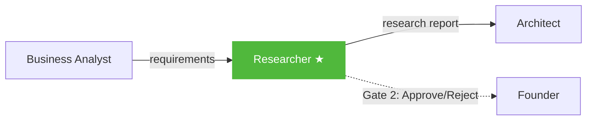

# Researcher Agent

The Researcher is the **third agent** in the pipeline. It takes the BA's requirements and goes out to the real world — searching the web for competitors, existing solutions, government schemes, relevant APIs, and data that grounds the project in reality.

## Role

> [!agent] Market Researcher
> **Mission:** Find real-world context that makes the project viable, not theoretical.
>
> The Researcher is the only agent with **external access**. While other agents work purely from context, the Researcher calls [[Tavily Integration|Tavily Search API]] to find actual competitors, existing government schemes, open datasets, and technology options. This grounds the project in reality — critical for [[SIH Context|SIH hackathon]] presentations where judges ask "what already exists?"

## Pipeline Position



**Position:** 3rd of 6 agents
**Approval Gate:** Yes (Gate 2)
**Reviewed by:** [[Business Analyst Agent]] (cross-review — "Does the research cover our requirements?")
**Reviews:** [[Architect Agent]] output (cross-review)

## Input

| Field | Details |
|-------|---------|
| **Source** | [[CEO Agent]] brief + [[Business Analyst Agent]] requirements via shared memory |
| **Format** | All previous approved outputs as context |
| **Key fields used** | BA's `functional_requirements`, `user_stories`, CEO's `problem_summary` |
| **External** | Tavily Search API calls (2-4 searches per run) |

## Output

The Researcher produces a **research report JSON** with:

| Field | Description |
|-------|-------------|
| `existing_solutions` | What already exists in this space (with URLs) |
| `competitors` | Direct competitors and their strengths/weaknesses |
| `government_schemes` | Relevant govt programs, especially for SIH problems |
| `relevant_apis` | APIs and datasets that could be integrated |
| `technology_recommendations` | Tech choices backed by research findings |
| `market_gaps` | Where existing solutions fall short (our opportunity) |
| `key_statistics` | Numbers and data points for the presentation |
| `sources` | URLs and references for all findings |

## Tavily Search Integration

> [!code] Web Search Pipeline
> ```
> Problem context → Generate 2-4 search queries
>     → Tavily API (AI-optimized search)
>         → Structured results with snippets
>             → LLM synthesizes into research report
> ```

The Researcher generates targeted search queries from the requirements, sends them to [[Tavily Integration|Tavily]], and synthesizes the results. Each search costs ~$0.005, so a full research phase is ~$0.01.

See [[Search API Comparison]] for why Tavily was chosen over DuckDuckGo.

## Model

> [!decision] Model Choice
> | Setting | Value |
> |---------|-------|
> | **Recommended** | Gemma 4 31B |
> | **Cost** | Free (via OpenRouter) |
> | **Why free?** | The heavy lifting is done by Tavily (external search). The LLM just synthesizes search results into a structured report. |
> | **Alternative** | Any model that can summarize well |

See [[Model Strategy]] for the full cost analysis.

## Performance

| Metric | Value |
|--------|-------|
| **Average time** | ~50s (model) + search latency |
| **Test run time** | 141s (with Nemotron 120B) |
| **Token output** | ~1000-1500 tokens |
| **Failure rate** | Low, but depends on Tavily API availability |
| **Search calls** | 2-4 per run |

## SIH-Specific Research

> [!pipeline] Hackathon Context
> For [[SIH Context|Smart India Hackathon]] problems, the Researcher specifically looks for:
> - Government of India digital initiatives related to the problem
> - Existing solutions by DRDO, ISRO, NIC, or other govt bodies
> - Open datasets on data.gov.in
> - State-level implementations of similar ideas
>
> This is crucial because SIH judges value awareness of existing government infrastructure.

## Key Files

- **Prompt:** `backend/app/agents/prompts.py` (Researcher system prompt)
- **Execution:** `backend/app/agents/engine.py` (agent runner)
- **Web search:** `backend/app/services/web_search.py` (Tavily integration)
- **Orchestrator call:** `backend/app/services/orchestrator.py`

---

Related: [[Agent Roster]], [[Business Analyst Agent]], [[Architect Agent]], [[Tavily Integration]], [[Search API Comparison]], [[SIH Context]]

#agent #researcher #web-search
