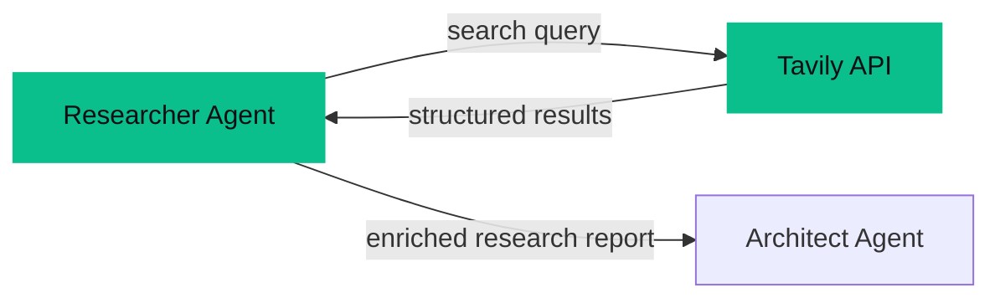

# Tavily Integration

The [[Researcher Agent]] uses Tavily Search API to find real-world data for every project. Tavily returns structured, AI-optimized search results — not raw HTML — making it ideal for agent consumption.

## Why Tavily?

> [!decision] Tavily Over DuckDuckGo
> See [[Search API Comparison]] for the full breakdown. TL;DR: DuckDuckGo's Python library broke repeatedly (version pinning issues, rate limits). Tavily is purpose-built for AI agents — structured JSON output, relevance scoring, and reliable uptime.

| Criteria | DuckDuckGo | Tavily |
|----------|-----------|--------|
| **Reliability** | Library breaks across versions | Stable API |
| **Output format** | Raw HTML snippets | Structured JSON with scores |
| **Rate limits** | Aggressive, undocumented | Clear tier limits |
| **Cost** | Free | ~$0.01/search |
| **AI-optimized** | No | Yes — built for LLM pipelines |

## How It Works



1. The [[Researcher Agent]] receives the BA's requirements
2. Agent formulates search queries based on the problem domain
3. Tavily returns top results with titles, URLs, content snippets, and relevance scores
4. Agent synthesizes results into a research report with citations
5. Report is passed to the [[Architect Agent]] as context

## Configuration

> [!code] Environment Variable
> ```
> TAVILY_API_KEY=tvly-xxxxx
> ```
> Set in `backend/.env`. The key is loaded in [[Tech Stack|the backend config]].

## Cost Impact

> [!status] Search Costs
> | Metric | Value |
> |--------|-------|
> | **Cost per search** | ~$0.01 |
> | **Searches per pipeline** | 1 |
> | **Monthly estimate (38 runs)** | ~$0.38 |
> | **Percentage of total cost** | ~3.8% |

The Researcher is the only agent that makes external API calls besides OpenRouter. See [[Budget & Costs]] for the full cost breakdown.

## SIH-Specific Usage

For [[SIH Context|Smart India Hackathon]] problems, the Researcher searches for:
- Existing government schemes and portals related to the problem
- Similar solutions already deployed in India
- Technical feasibility data and case studies
- Open datasets from data.gov.in and other sources

This is especially important because SIH problem statements are often just 1-2 lines — the Researcher fills in the context that the problem statement doesn't provide.

## Key Files

- **Search integration:** `backend/app/agents/engine.py` (Tavily call in `run_agent()`)
- **API key config:** `backend/.env`
- **Agent prompt:** `backend/app/agents/prompts.py` (Researcher section)

---

Related: [[Researcher Agent]], [[Search API Comparison]], [[Budget & Costs]], [[Tech Stack]], [[Pipeline Flow]]

#integration #tavily #search
