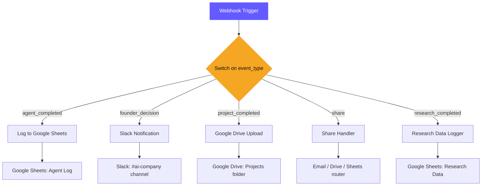

# n8n Integration

The AI Software Company sends real-time webhook events to an n8n instance for external integrations — Google Sheets logging, Slack notifications, Google Drive uploads, and more.

## Instance Details

> [!status] n8n Server
> | Setting | Value |
> |---------|-------|
> | **Host** | `srv1867770.hstgr.cloud` |
> | **Webhook URL** | `https://n8n.srv1867770.hstgr.cloud/webhook/ai-company` |
> | **Workflow Name** | AI Software Company - Event Hub |
> | **Workflow ID** | `RBH6k2XRoPFmxm3G` |
> | **Status** | Active |

## Event Types

The backend sends 5 event types to n8n, routed by the `event_type` field in the webhook payload:

| Event Type | Trigger | Payload Includes |
|------------|---------|------------------|
| `agent_completed` | Any agent finishes its task | `project_id`, `agent_role`, `output_summary`, `timestamp` |
| `founder_decision` | Founder approves or rejects an output | `project_id`, `agent_role`, `decision`, `feedback` |
| `project_completed` | All 6 agents done, deliverables ready | `project_id`, `project_name`, `deliverable_urls` |
| `share` | User clicks share button (Drive/Sheets/Email) | `project_id`, `share_target`, `file_type` |
| `research_completed` | Researcher finishes with search results | `project_id`, `search_queries`, `sources_count` |

## Backend Implementation

> [!code] Webhook Service
> **File:** `backend/app/services/webhook.py`
>
> Key functions:
> - `send_agent_event(project_id, role, output)` — fires on agent completion
> - `send_research_data(project_id, research)` — fires with search results
> - `send_approval_event(project_id, role, approved, feedback)` — fires on founder decision
> - `send_deliverables_ready(project_id, files)` — fires when all deliverables generated
>
> Uses `httpx` async client. Webhook URL is set in `.env` as `N8N_WEBHOOK_URL`.

## n8n Workflow Architecture



## Integration Status

> [!pipeline] Node Status
> | Integration | Status | Notes |
> |-------------|--------|-------|
> | **Webhook Trigger** | Active | Receiving all 5 event types |
> | **Switch Router** | Active | Routes by `event_type` field |
> | **Google Sheets** | Placeholder | Needs OAuth credentials |
> | **Slack** | Placeholder | Needs OAuth credentials |
> | **Google Drive** | Placeholder | Needs OAuth credentials |
> | **Email** | Placeholder | Needs SMTP or Gmail OAuth |

## Webhook Payload Format

```json
{
  "event_type": "agent_completed",
  "project_id": "1c6d47e1f0d3",
  "timestamp": "2026-08-09T10:30:00Z",
  "data": {
    "agent_role": "business_analyst",
    "output_summary": "Generated 12 requirements across 4 categories",
    "status": "pending_review"
  }
}
```

## Configuration

The webhook URL is configured in the backend `.env` file:

```
N8N_WEBHOOK_URL=https://n8n.srv1867770.hstgr.cloud/webhook/ai-company
```

The webhook service is initialized in `backend/app/main.py` and called by the [[Orchestrator]] at each pipeline stage.

---

Related: [[Orchestrator]], [[API Reference]], [[Tech Stack]], [[Pipeline Test Results]]

#integration #n8n #webhook
