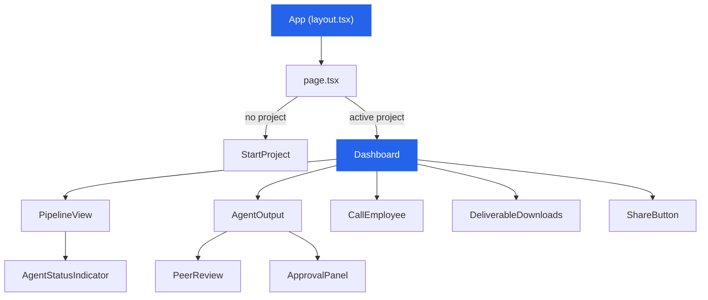

# Component Architecture

The frontend is a Next.js 14 application using App Router. This page maps every major component, its responsibility, and how they connect to the backend via API calls and WebSocket events.

## Component Tree



## Components

### StartProject (ProjectWizard)

| Property | Details |
|----------|---------|
| **File** | `frontend/src/components/StartProject.tsx` |
| **Purpose** | Problem statement input form — the entry point |
| **State** | Local state (controlled input) |
| **API call** | `POST /projects` to create project and start pipeline |
| **UX** | Text area + "Start Company" button. Minimal, focused. |

The Founder types a problem statement (from [[SIH Context|SIH's 498 problems]]) and clicks "Start Company." This creates a project in the [[Database Schema|database]] and triggers the [[Orchestrator]].

### Dashboard

| Property | Details |
|----------|---------|
| **File** | `frontend/src/components/Dashboard.tsx` |
| **Purpose** | Main view after project starts — shows all pipeline activity |
| **State** | WebSocket-driven (real-time updates) |
| **Children** | PipelineView, AgentOutput (x6), CallEmployee, DeliverableDownloads, ShareButton |
| **Layout** | Left: pipeline progress. Center: agent outputs. Right: actions. |

### PipelineView

| Property | Details |
|----------|---------|
| **File** | `frontend/src/components/Pipeline.tsx` |
| **Purpose** | Visual representation of the 6-agent pipeline |
| **Shows** | Agent status indicators, gate states, progress flow |
| **Updates** | Via WebSocket events from [[Orchestrator]] |

Agent states rendered:

| State | Visual | Meaning |
|-------|--------|---------|
| `pending` | Gray circle | Not started yet |
| `running` | Pulsing blue | Agent is processing |
| `review` | Yellow circle | Waiting for approval ([[Approval Gate Design|Gate]]) |
| `approved` | Green checkmark | Founder approved |
| `rejected` | Red circle | Founder rejected, agent revising |
| `completed` | Green checkmark | Done (auto-approved agents) |
| `error` | Red X | Agent failed |

### AgentOutput

| Property | Details |
|----------|---------|
| **File** | `frontend/src/components/AgentOutput.tsx` |
| **Purpose** | Displays one agent's output as a formatted card |
| **Children** | PeerReview, ApprovalPanel |
| **Features** | Expandable sections, formatted JSON, code blocks |
| **Updates** | WebSocket event when agent completes |

### ApprovalPanel

| Property | Details |
|----------|---------|
| **File** | Part of `AgentOutput.tsx` |
| **Purpose** | Approve/Reject buttons + feedback text area |
| **API calls** | `POST /projects/{id}/approve`, `POST /projects/{id}/reject` |
| **Visibility** | Only shown when agent is in "review" state |

### CallEmployee

| Property | Details |
|----------|---------|
| **File** | `frontend/src/components/CallEmployee.tsx` |
| **Purpose** | Direct chat with any agent |
| **API call** | `POST /projects/{id}/call-employee` |
| **Features** | Select agent dropdown, chat interface, context-aware responses |
| **Special** | [[Engineer Agent]] enters "pair programming mode" — returns updated files |

### DeliverableDownloads

| Property | Details |
|----------|---------|
| **File** | Part of `Dashboard.tsx` |
| **Purpose** | Download buttons for generated files |
| **Files** | `.zip` (code), `.pptx` (slides), `.docx` (report) |
| **Visibility** | Only shown when pipeline is complete |
| **Backend** | [[File Generator]] produces the files |

### ShareButton

| Property | Details |
|----------|---------|
| **File** | Part of `Dashboard.tsx` |
| **Purpose** | Generate a shareable link to the project output |
| **API call** | `POST /projects/{id}/share` |

### PeerReview

| Property | Details |
|----------|---------|
| **File** | Part of `AgentOutput.tsx` |
| **Purpose** | Displays [[Cross Review System|cross-review]] commentary |
| **Shows** | Reviewer's team note, strengths, concerns, suggestions |
| **Styling** | Quoted block with reviewer attribution |

## Data Flow

```
User action → API call → Backend processes → WebSocket event → State update → UI re-render
```

All real-time updates come through a single WebSocket connection per project. The [[API Reference]] documents all endpoints used by these components.

## Styling

All components use CSS Variables for theming. See [[Theme & Design]] for the complete design system. No Tailwind CSS — everything is custom CSS for full control.

---

Related: [[Frontend Dashboard]], [[Theme & Design]], [[API Reference]], [[Orchestrator]], [[Approval Gate Design]], [[Cross Review System]]

#frontend #components #architecture
