# Approval Gate Design

The pipeline has **4 approval gates** — not 6. This page explains why, how the approve/reject flow works, and what happens when a Founder rejects an agent's output.

## Gate Architecture

```mermaid
graph LR
    CEO["CEO"] -->|auto| BA["BA"]
    BA -->|"Gate 1"| G1{"Approve?"}
    G1 -->|yes| RES["Researcher"]
    G1 -->|no + feedback| BA
    RES -->|"Gate 2"| G2{"Approve?"}
    G2 -->|yes| ARCH["Architect"]
    G2 -->|no + feedback| RES
    ARCH -->|"Gate 3"| G3{"Approve?"}
    G3 -->|yes| ENG["Engineer"]
    G3 -->|no + feedback| ARCH
    ENG -->|"Gate 4"| G4{"Approve?"}
    G4 -->|yes| PPT["PPT"]
    G4 -->|no + feedback| ENG
    PPT -->|auto| DONE["Deliverables"]

    style G1 fill:#f39c12,stroke:#f39c12,color:#fff
    style G2 fill:#f39c12,stroke:#f39c12,color:#fff
    style G3 fill:#f39c12,stroke:#f39c12,color:#fff
    style G4 fill:#f39c12,stroke:#f39c12,color:#fff
```



## Why 4 Gates, Not 6?

> [!decision] Two Agents Skip Approval
> | Agent | Has Gate? | Why |
> |-------|-----------|-----|
> | CEO | No | The CEO's output is a brief that starts the pipeline. There is nothing to reject yet — if the brief is bad, it shows up in the BA's requirements, which the Founder reviews at Gate 1. |
> | BA | **Gate 1** | First real output. Must be reviewed. |
> | Researcher | **Gate 2** | Research must be verified. |
> | Architect | **Gate 3** | Tech choices are critical. |
> | Engineer | **Gate 4** | Code must be reviewed before presentation. |
> | PPT | No | Last agent. Content derives from 4 already-approved outputs. No downstream consumer. Adding a gate here would slow delivery for minimal benefit. |

The [[CEO Agent]] and [[PPT Agent]] are bookends — one generates the initial direction, the other compiles the final summary. Neither benefits from a manual gate.

## Approval Flow

When an agent completes work, the flow is:

```
Agent completes work
  → Cross-review runs (teammate reviews output)
  → Status set to "review"
  → WebSocket: agent output + peer review sent to frontend
  → Founder sees output card with:
      - Agent's work
      - Peer review commentary
      - [Approve] and [Reject] buttons
```

### On Approve

| Step | What Happens |
|------|-------------|
| 1 | Output stored in shared memory as approved |
| 2 | Status set to "approved" |
| 3 | [[Webhook System]] fires `agent_completed` event |
| 4 | [[Orchestrator]] advances to next agent |
| 5 | Next agent starts with access to all prior approved outputs |

### On Reject

| Step | What Happens |
|------|-------------|
| 1 | Founder writes feedback explaining what is wrong |
| 2 | Feedback stored in shared memory as `revision_feedback_{role}` |
| 3 | Status set to "revising" |
| 4 | Agent re-runs with original context + rejection feedback |
| 5 | Agent produces new output incorporating the feedback |
| 6 | Flow returns to review state (Founder sees revised output) |

> [!pipeline] Feedback Loop
> Rejection is not a dead end — it is a **feedback loop**. The agent sees exactly what the Founder disliked and adjusts. Multiple rejections are possible but rare (1-2 rounds usually resolves issues). The feedback is additive — each rejection adds to the context, so the agent learns from all prior rejections.

## Gate Timing

Each gate adds waiting time to the pipeline. This is the trade-off:

| Scenario | Pipeline Time | Quality Control |
|----------|--------------|-----------------|
| 0 gates (fully auto) | ~5 min | None — garbage propagates |
| 4 gates (current) | ~5 min + review time | High — Founder catches issues |
| 6 gates (every agent) | ~5 min + more review time | Marginal improvement over 4 |

The [[Cross Review System]] reduces the need for gates by catching issues automatically. Peer reviews surface problems before the Founder even looks.

## Frontend Implementation

The [[Frontend Dashboard]] shows approval gates as interactive cards in the [[Component Architecture|PipelineView component]]:

- **Pending agents**: Grayed out, waiting
- **Active agent**: Pulsing indicator, processing
- **Review state**: Output card visible, Approve/Reject buttons enabled
- **Approved**: Green checkmark, output collapsed
- **Rejected**: Red indicator, feedback field visible

## Key Files

- `backend/app/services/orchestrator.py` — Gate logic, approval/rejection handlers
- `backend/app/api/routes.py` — `/approve` and `/reject` endpoints
- `frontend/src/components/AgentOutput.tsx` — Approval UI
- `frontend/src/components/Pipeline.tsx` — Gate visualization

---

Related: [[How It Works]], [[Cross Review System]], [[Orchestrator]], [[Pipeline Flow]], [[Agent Roster]], [[Frontend Dashboard]]

#decision #approval #pipeline
