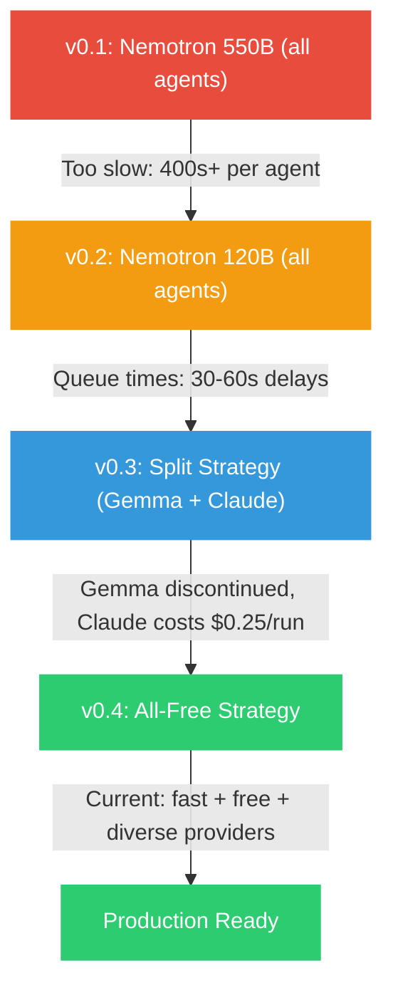

# Model Selection History

A timeline of every model change, why it happened, and what was learned. Getting models right was the single biggest technical challenge — more impactful than any code decision.

## Timeline

---

## Phase 1: Nemotron 550B (Everything Free)

> [!decision] Starting Point — Go Big or Go Home
> **Idea:** Use the most powerful free model for everything.
> **Model:** NVIDIA Nemotron 550B via OpenRouter
> **Cost:** $0.00

### What Happened

| Problem | Details |
|---------|---------|
| **Generation time** | 400+ seconds PER AGENT (total pipeline: 30+ minutes) |
| **Queue delays** | Free tier = lowest priority on OpenRouter, massive queues |
| **Timeouts** | Engineer agent frequently timed out mid-generation |
| **User experience** | Waiting 30 minutes for a pipeline run is unusable |

### Lesson

> Raw model size does not equal better results for structured tasks. A 550B model extracting requirements is not measurably better than a 30B model doing the same structured extraction.

---

## Phase 2: Nemotron 120B (Smaller, Still Free)

> [!decision] Compromise — Same Approach, Smaller Model
> **Idea:** Smaller Nemotron, fewer queue issues.
> **Model:** NVIDIA Nemotron 120B via OpenRouter
> **Cost:** $0.00

### What Happened

| Improvement | Still Broken |
|-------------|-------------|
| Faster generation per token | Still queued behind paid users |
| More reliable completions | 30-60s queue wait per agent |
| Better context handling | Engineer still slow (400s) |
| | Total pipeline: 13+ minutes with queue waits |

### Lesson

> The problem is not model size — it is the free tier's queue priority. Free models on OpenRouter serve paid users first. During peak hours, queue waits dominate total time.

---

## Phase 3: Split Strategy (Gemma + Claude Sonnet)

> [!decision] The Breakthrough — Pay Only Where It Matters
> **Idea:** Use free Gemma 4 31B for simple tasks. Pay Claude Sonnet 4 for code generation.
> **Cost:** ~$0.26 per run

### The Split

| Agent | Model | Cost | Why |
|-------|-------|------|-----|
| CEO, BA, Researcher, PPT, Reviews | Gemma 4 31B | Free | Structured extraction, fast |
| Architect | DeepSeek V3 | Free | Strong at technical specs |
| **Engineer** | **Claude Sonnet 4** | **~$0.25** | Code quality = product quality |

### What Happened

- Worked great initially — pipeline ran in 5-8 minutes
- Gemma 4 31B was discontinued on OpenRouter (model removed)
- DeepSeek V3 0217 also became unavailable
- Claude Sonnet 4 costs added up for testing ($0.25/run × many test runs)

### Lesson

> Relying on specific free models is risky — they get discontinued without warning. Need a strategy that's resilient to model churn.

---

## Phase 4: All-Free Strategy (Current — Sep 2026)

> [!decision] The Pragmatic Choice — Diversify Free Models
> **Idea:** Use multiple free models from different providers, matched to task complexity.
> **Cost:** $0.00

### The Strategy

| Tier | Model | Agents | Rationale |
|------|-------|--------|-----------|
| **Fast** | Nemotron 3.5 Lightning (30B MoE) | CEO, PPT, Reviews | Lightweight tasks, sub-30s response |
| **Strong** | Nemotron 3 Super (120B MoE) | BA, Researcher, Architect | Complex reasoning, 120B quality |
| **Code** | Cohere North Mini Code | Engineer | Purpose-built for code generation |

### Key Changes from Phase 3

1. **No paid models** — all agents use free-tier models
2. **Provider diversity** — NVIDIA + Cohere reduces shared rate limit risk
3. **Rate limit resilience** — 429 errors now retry with 3x backoff instead of crashing
4. **Fallback model** — If primary fails, falls back to Nemotron 3.5 Lightning

### Model Slug Gotcha

> [!danger] OpenRouter Model IDs
> OpenRouter model IDs include the full parameter suffix. `nvidia/nemotron-3-ultra:free` does NOT work — the correct ID is `nvidia/nemotron-3-ultra-550b-a55b:free`. Always verify against the `/api/v1/models` endpoint.

### Results

| Metric | Phase 3 (Split) | Phase 4 (All-Free) |
|--------|-----------------|---------------------|
| Pipeline time | 5-8 minutes | 5-12 minutes (free tier queue variance) |
| Cost per run | $0.26 | $0.00 |
| Code quality | High (Claude) | Good (Cohere code model) |
| Reliability | Rare failures | Retries handle rate limits |
| Model risk | High (discontinuation) | Spread across 3 providers |

### Lesson

> For a bootstrapped product, $0.00/run enables unlimited iteration. The quality tradeoff on code generation is acceptable for MVP — upgrade the Engineer model to a paid model when revenue justifies it.

---

## Bugs Fixed Along the Way

### Rate Limit Fatal Error (Sep 2026)
- **Bug:** 429 rate limit errors were treated as fatal — pipeline crashed immediately
- **Fix:** Separated `_is_rate_limit()` from `_is_fatal()` in `engine.py`. Rate limits now retry with 3x backoff (6s, 12s, 24s)
- **File:** `backend/app/agents/engine.py`

### Heartbeat NameError (Sep 2026)
- **Bug:** `_start_next_agent._run()` referenced `heartbeat` variable from `_run_pipeline()` scope, crashing after each agent
- **Fix:** Removed stale `heartbeat` and `token` cleanup from `_run()` finally block — those belong only in `_run_pipeline()`
- **File:** `backend/app/services/orchestrator.py`

### Peer Review Object Render (Sep 2026)
- **Bug:** Free models returned `{issue: "...", why: "..."}` objects in review arrays instead of plain strings, crashing React
- **Fix:** Added `safeText()` helper to stringify any non-string review items
- **File:** `frontend/src/components/AgentOutput.tsx`

---

Related: [[Model Strategy]], [[Budget & Costs]], [[Engineer Agent]], [[Architect Agent]], [[Pipeline Test Results]]

#decision #models #history
