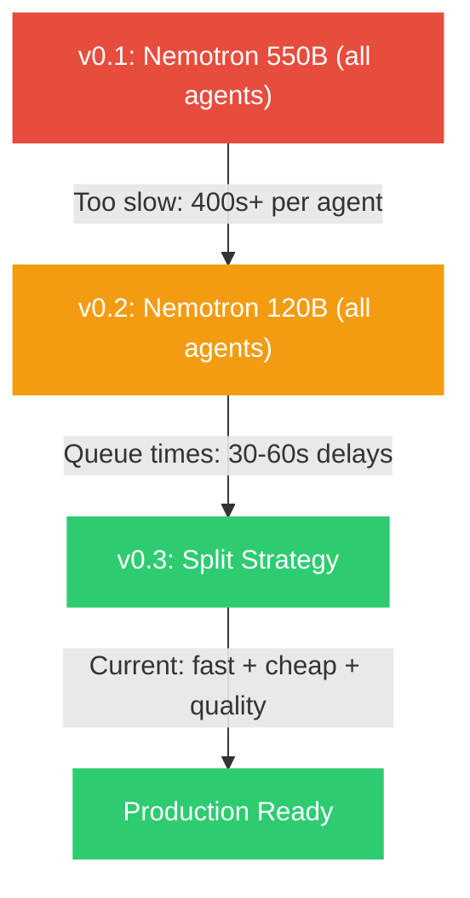

# Model Selection History

A timeline of every model change, why it happened, and what was learned. Getting models right was the single biggest technical challenge — more impactful than any code decision.

## Timeline

---

## Phase 1: Nemotron 550B (Everything Free)

> [!decision] Starting Point — Go Big or Go Home
> **Idea:** Use the most powerful free model for everything.
> **Model:** NVIDIA Nemotron 550B via OpenRouter
> **Cost:** $0.00

### What Happened

| Problem | Details |
|---------|---------|
| **Generation time** | 400+ seconds PER AGENT (total pipeline: 30+ minutes) |
| **Queue delays** | Free tier = lowest priority on OpenRouter, massive queues |
| **Timeouts** | Engineer agent frequently timed out mid-generation |
| **Context issues** | 550B model was slower to process large contexts |
| **User experience** | Waiting 30 minutes for a pipeline run is unusable |

### Lesson

> Raw model size does not equal better results for structured tasks. A 550B model extracting requirements is not measurably better than a 30B model doing the same structured extraction.

---

## Phase 2: Nemotron 120B (Smaller, Still Free)

> [!decision] Compromise — Same Approach, Smaller Model
> **Idea:** Smaller Nemotron, fewer queue issues.
> **Model:** NVIDIA Nemotron 120B via OpenRouter
> **Cost:** $0.00

### What Happened

| Improvement | Still Broken |
|-------------|-------------|
| Faster generation per token | Still queued behind paid users |
| More reliable completions | 30-60s queue wait per agent |
| Better context handling | Engineer still slow (400s) |
| | Total pipeline: 13+ minutes with queue waits |

### Test Run Results

From [[Pipeline Test Results]]:

| Agent | Time with 120B | Acceptable? |
|-------|---------------|-------------|
| CEO | 96s | Barely |
| BA | 125s | Too slow |
| Researcher | 141s | Too slow |
| Architect | 5s | Fast (different model?) |
| Engineer | 400s+ | Way too slow |

### Lesson

> The problem is not model size — it is the free tier's queue priority. Free models on OpenRouter serve paid users first. During peak hours, queue waits dominate total time.

---

## Phase 3: Split Strategy (Current)

> [!decision] The Breakthrough — Pay Only Where It Matters
> **Idea:** Use free models for simple tasks. Pay for the ONE task where quality = product quality.
> **Cost:** ~$0.26 per run

### The Split

| Agent | Old Model | New Model | Why Changed |
|-------|-----------|-----------|-------------|
| CEO | Nemotron 120B | Gemma 4 31B | Faster, no queue, equally good for extraction |
| BA | Nemotron 120B | Gemma 4 31B | Same rationale |
| Researcher | Nemotron 120B | Gemma 4 31B | Search does the heavy lifting, not the model |
| Architect | Nemotron 120B | DeepSeek V3 | Stronger reasoning for technical specs, still free |
| **Engineer** | Nemotron 120B | **Claude Sonnet 4** | Only agent where output quality = product quality |
| PPT | Nemotron 120B | Gemma 4 31B | Content derivation, not generation |

### Why Gemma 4 31B?

- Free on OpenRouter (genuinely $0.00)
- Fast inference (no queue issues)
- Good at structured extraction (the primary task for 4/6 agents)
- 31B parameters is sufficient for requirements, summaries, and reviews
- Consistent JSON output

### Why DeepSeek V3 for Architect?

- Free on OpenRouter (0217 snapshot)
- Stronger at technical reasoning than Gemma
- Excellent at structured technical output
- Fastest agent in the pipeline at 5s
- See [[Architect Agent]] for details

### Why Claude Sonnet 4 for Engineer?

- Best code generation quality available
- Handles multi-file projects (10-16K tokens) reliably
- Maintains import consistency across files
- At $0.25/run, the ROI is massive — a complete project for a quarter
- See [[Engineer Agent]] for the full justification

### Results

| Metric | Before (Nemotron 120B) | After (Split) |
|--------|----------------------|--------------|
| Pipeline time | 13+ minutes | 5-8 minutes |
| Cost per run | $0.00 | $0.26 |
| Code quality | Moderate | High |
| Reliability | Frequent timeouts | Rare failures |
| Queue delays | 30-60s per call | None (paid priority) |

### Lesson

> The split strategy is the optimal balance. Free models handle 5 of 6 agents perfectly. Paying for the Engineer agent is a 100x ROI — you get a runnable project for $0.25.

---

Related: [[Model Strategy]], [[Budget & Costs]], [[Engineer Agent]], [[Architect Agent]], [[Pipeline Test Results]], [[OmniRoute Setup]]

#decision #models #history
