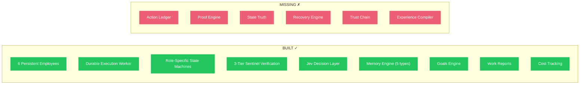
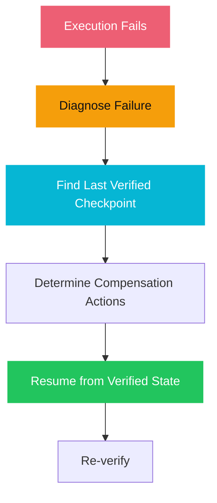
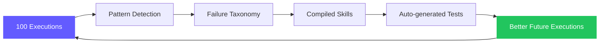
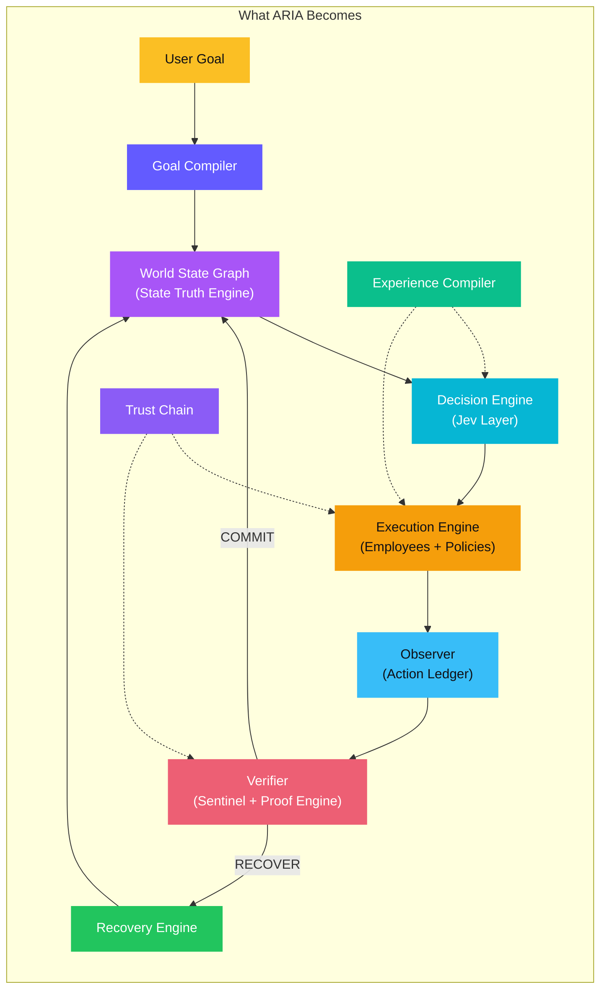

# AI Action Infrastructure — Implementation Roadmap

> **6 features that transform ARIA from "AI agent platform" to "AI Action Infrastructure" — the first reliability runtime for autonomous AI.**

---

## Where We Are Now (V3 — Sept 2026)



### What V3 Can Do
- User sets a goal → employees work autonomously → Sentinel verifies → deliver output
- Role-specific execution policies with structured transitions
- 3-tier verification (Structural → Deep → Domain)
- Cheap model routing via Jev
- "While You Were Away" reports

### What V3 Cannot Do
- **Prove** that output quality improved (no scorecard, no metrics)
- Track **why** an action was taken or **what evidence** supports it
- Distinguish between "agent remembers doing X" and "X is actually true right now"
- Recover intelligently from failure (just retries blindly)
- Track accountability across agent-to-agent delegation
- Learn from past executions to improve future ones

---

## The 6 Features (Build Order)

### Feature 1: Action Ledger (Foundation)

> Every execution step becomes a causal record with evidence.

```
ACTION:          Scout researched competitor pricing
INTENT:          Gather market data for pricing recommendation
ACTOR:           Scout (Researcher)
AUTHORITY:       Delegated by Atlas via Goal #42
PRECONDITIONS:   ✓ Web search tool available, ✓ target URLs accessible
EVIDENCE:        3 URLs scraped, 847 tokens analyzed, 5 data points extracted
EXPECTED EFFECT: Pricing data in working memory
ACTUAL EFFECT:   Pricing data stored (5 competitors, 3 pricing tiers each)
VERIFICATION:    Sentinel Tier 1 PASS — data internally consistent
COMMIT:          STATE := RESEARCH_COMPLETE
AUDIT:           2026-09-28T14:22:03Z, cost: $0.004, duration: 3.2s
```

**This is the commit primitive from the deep thesis.** Everything else reads from and writes to the ledger.

| What It Replaces | What It Becomes |
|-----------------|-----------------|
| `result = tool(); memory.save(result)` | `proposal → preconditions → execution → observation → verification → COMMIT` |
| "Scout finished researching" | "Scout produced 5 verified data points from 3 sources with Sentinel confirmation" |
| Opaque phase transitions | Auditable causal chain |

---

### Feature 2: Verification Proof Engine

> Make quality guarantee visible and quantifiable.

**Per-execution scorecard:**
- Issues Sentinel caught (count, severity)
- Raw output quality score vs verified quality score
- Cost of verification vs estimated cost of uncaught bugs
- What would have shipped without ARIA's verification

**Aggregate dashboard:**
- Total bugs caught across all executions
- Average quality improvement percentage
- Total cost saved
- Quality trend over time

**The killer demo:** Same goal → ChatGPT output vs ARIA output + scorecard showing "Sentinel caught 3 issues. Verification cost: $0.03. Your output is 47% more reliable."

---

### Feature 3: State Truth Engine

> Memory tells what was remembered. State Truth tells what is *actually true right now.*

| Before (Memory) | After (State Truth) |
|-----------------|-------------------|
| "I deployed the app" | `STATE := DEPLOYED` only if health check = 200 + correct version + smoke test passed |
| "I wrote the tests" | `STATE := TESTS_WRITTEN` only if files exist + tests parse + tests run |
| "Research is complete" | `STATE := RESEARCH_COMPLETE` only if sources verified + data internally consistent |

Every claim becomes: `CLAIM + EVIDENCE → VERIFIED / UNVERIFIED`

**Closes Gap A (State Truth)** from the deep thesis.

---

### Feature 4: Recovery Engine

> When something fails, don't retry(). Diagnose → checkpoint → compensate → resume.



| Before | After |
|--------|-------|
| `retry(max=3)` | Diagnose: "Failed because API returned 429, not a logic error" |
| Start over from scratch | Resume from last verified checkpoint |
| Same approach, hope it works | Adapt strategy based on failure diagnosis |

**Closes Gap D (Recovery)** from the deep thesis.

---

### Feature 5: Cross-Agent Trust Chain

> Who authorized what, based on which evidence?

When Atlas delegates to Scout who delegates to a web search tool:

```
DELEGATION CHAIN:
  User Goal #42 → Atlas (authorized: full scope)
    → Scout (authorized: research only, no code execution)
      → Web Search (authorized: read-only, domains: [*.com])
        
EVIDENCE CHAIN:
  Scout claims: "Found 5 pricing data points"
  Evidence: URLs accessed, raw data extracted, Sentinel verified consistency
  Atlas claims: "Pricing recommendation based on Scout's data"  
  Evidence: References Scout's verified research + own analysis
  Sentinel claims: "Recommendation is well-supported"
  Evidence: Independent review of full chain
```

**Closes Gap E (Cross-Agent Trust)** from the deep thesis.

---

### Feature 6: Experience Compiler (The Moat)

> Execution trajectories + failure patterns → reusable skills with tests.



- "Atlas fails at database migrations in these 5 ways" → pre-check procedure
- "Scout's research quality drops when > 10 sources" → auto-limit + synthesize
- "Sentinel Tier 1 catches 73% of formatting issues" → skip to Tier 2 for formatting-heavy outputs

**This is the moat.** The runtime is copyable. The accumulated operational intelligence is not.

---

## Gap Closure Map

| Deep Thesis Gap | Current State | After Implementation |
|----------------|---------------|---------------------|
| **A. State Truth** | Memory = what agent remembers | State = what is verifiably true right now |
| **B. Action Truth** | Agent says "done" | Ledger proves done with evidence chain |
| **C. Causal History** | Something changed | Ledger records why, which action, which evidence |
| **D. Recovery** | `retry()` | Diagnose → checkpoint → compensate → resume |
| **E. Cross-Agent Trust** | Delegation happens | Delegation has proof trail with accountability |
| **Moat** | Code (copyable) | Accumulated intelligence (not copyable) |

---

## Where We'll Be After All 6



**ARIA goes from:** "AI platform with 6 agents that verify each other's work"
**To:** "The first AI Action Infrastructure — a model-agnostic reliability runtime that proves what happened, guarantees quality, recovers intelligently, and gets smarter with every execution"

No one else is building this. Not Cursor. Not Replit. Not Lovable. Not even the multi-agent frameworks. They're all still at `result = tool(); memory.save(result)`.

---

Related: [[Deep Thesis — AI Action Infrastructure]], [[Core Thesis]], [[Roadmap]], [[Multi-Tier Sentinel]], [[Execution Policies]]

#roadmap #action-infrastructure #locked
