# Pipeline Test Results

Full end-to-end test run of the AI Software Company pipeline.

## Test Summary

> [!status] Test Run: Smart Waste Management
> | Field | Value |
> |-------|-------|
> | **Project ID** | `1c6d47e1f0d3` |
> | **Problem Statement** | Smart waste management for Indian municipalities |
> | **Model Used** | Nemotron 120B (free, all agents) |
> | **Result** | All 3 deliverables generated successfully |
> | **n8n Events** | 12/12 webhook events delivered |

## Agent Timing

| Agent | Time | Notes |
|-------|------|-------|
| **CEO** | 96s | Simple extraction, model overhead |
| **Business Analyst** | 125s | Requirements generation |
| **Researcher** | 141s | Includes web search time (Tavily) |
| **Architect** | 5s | Fastest — technical spec from clear inputs |
| **Engineer** | 400s+ | Longest — 16K token code generation |
| **PPT Agent** | ~60s | Slide content extraction |
| **Total** | ~14 minutes | End to end, including founder approvals |

```mermaid
gantt
    title Pipeline Execution Timeline
    dateFormat ss
    axisFormat %S s

    section Agents
    CEO           :a1, 00, 96s
    BA            :a2, after a1, 125s
    Researcher    :a3, after a2, 141s
    Architect     :a4, after a3, 5s
    Engineer      :a5, after a4, 400s
    PPT           :a6, after a5, 60s
```

## Deliverables Generated

> [!pipeline] Output Files
> | Deliverable | Format | Status | Description |
> |-------------|--------|--------|-------------|
> | **Project Code** | `.zip` | Generated | Complete runnable project with frontend + backend |
> | **Presentation** | `.pptx` | Generated | Pitch deck with problem, solution, architecture slides |
> | **Document** | `.docx` | Generated | Project documentation with requirements and specs |

## n8n Webhook Events

All 12 webhook events were sent to `https://n8n.srv1867770.hstgr.cloud/webhook/ai-company` and received successfully:

| # | Event Type | Agent/Stage | Status |
|---|------------|-------------|--------|
| 1 | `agent_completed` | CEO | Delivered |
| 2 | `agent_completed` | Business Analyst | Delivered |
| 3 | `founder_decision` | BA Approved | Delivered |
| 4 | `agent_completed` | Researcher | Delivered |
| 5 | `research_completed` | Search Results | Delivered |
| 6 | `founder_decision` | Researcher Approved | Delivered |
| 7 | `agent_completed` | Architect | Delivered |
| 8 | `founder_decision` | Architect Approved | Delivered |
| 9 | `agent_completed` | Engineer | Delivered |
| 10 | `founder_decision` | Engineer Approved | Delivered |
| 11 | `agent_completed` | PPT Agent | Delivered |
| 12 | `project_completed` | All Deliverables | Delivered |

## Observations

> [!decision] Key Findings
> 1. **Architect is blazing fast** — 5s because it has the clearest input (structured requirements + research)
> 2. **Engineer is the bottleneck** — 400s+ for 16K tokens. Expected. This is the hardest task.
> 3. **Free model worked** — Nemotron 120B handled all agents, but code quality from Engineer would be better with Claude Sonnet 4
> 4. **Web search adds value** — Researcher found relevant government schemes and existing solutions
> 5. **n8n is reliable** — 12/12 events delivered without failures

## Recommendations

Based on this test run:
- Use **Claude Sonnet 4** for Engineer in production (see [[Model Strategy]])
- Keep free models for all other agents — they performed well
- The 400s Engineer time is acceptable; users see real-time progress via WebSocket
- n8n webhook integration is production-ready

---

Related: [[Orchestrator]], [[Model Strategy]], [[n8n Integration]], [[Agent Roster]], [[Roadmap]]

#test #results
