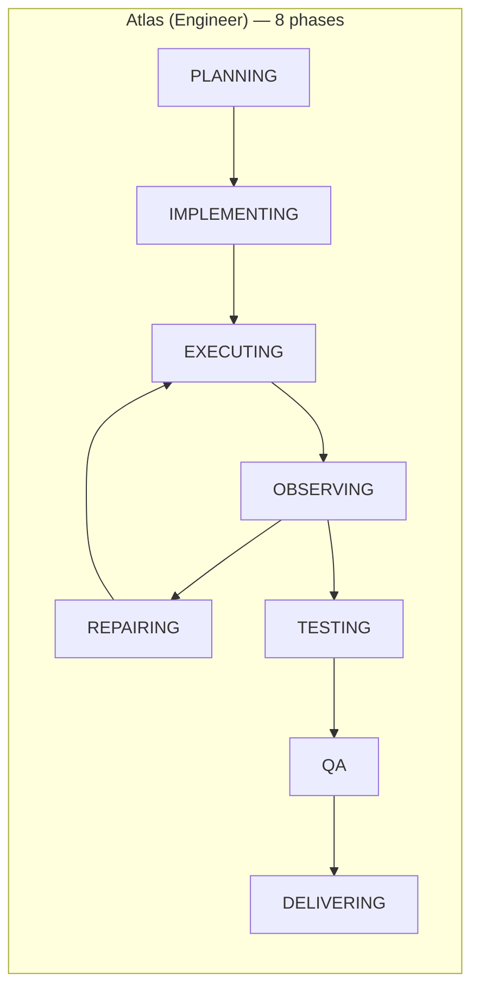

# Execution Policies

> **Role-specific state machines. Each employee type has its own phases, transitions, and prompts.**

## Why Not One State Machine?

A researcher and an engineer work differently:
- Atlas (Engineer): Plan → Implement → Execute → Observe → Repair → Test → QA → Deliver
- Scout (Researcher): Plan → Research → Analyze → Synthesize → QA → Deliver

Same pipeline, different workflows. Each policy defines valid state transitions — the LLM can't skip phases or go backwards (unless repairing).

## Policy Overview



| Employee | Role | Phases | Key Difference |
|----------|------|--------|----------------|
| **Atlas** | Software Engineer | 8 | Has EXECUTING → OBSERVING → REPAIRING loop |
| **Scout** | Researcher | 6 | RESEARCHING → ANALYZING → SYNTHESIZING |
| **Arc** | Architect | 6 | DESIGNING → EVALUATING → REFINING |
| **Sage** | Business Analyst | 6 | ANALYZING → STRUCTURING → REVIEWING |
| **Sentinel** | QA Engineer | 7 | Has TESTING → REPORTING phase |
| **Scribe** | Technical Writer | 6 | RESEARCHING → WRITING → REVIEWING |
| **Generic** | Fallback | 5 | Simplified for unknown roles |

## Structured Transitions

The LLM returns JSON decisions:

```json
{
    "next_state": "TESTING",
    "confidence": 0.9,
    "reason": "All unit tests written, ready for validation"
}
```

Validated against the policy's transition graph. If JSON parsing fails, falls back to string matching against valid transitions.

## Terminal Phases

`COMPLETED`, `FAILED`, `CANCELLED` — execution stops. The controller records final state, artifacts, and cost breakdown.

## File

`backend/app/services/execution_policies.py` — all policies, Phase enum, transition validation.

---

Related: [[Multi-Tier Sentinel]], [[Jev Decision Layer]]

#execution #policies #state-machine
