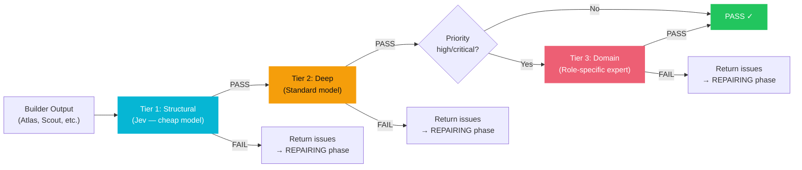

# Multi-Tier Sentinel Verification

> **Independent 3-tier quality assurance. Builder never grades its own work.**

## How It Works

## Tier Details

### Tier 1 — Structural Sentinel (Jev Layer)
- **Model:** Lightning 30B (cheapest available)
- **LLM Role:** `jev`
- **Checks:** Does output exist? Is it relevant? Is it complete? Obvious errors?
- **Cost:** ~5% of a full review
- **Catches:** ~60% of failures

### Tier 2 — Deep Sentinel
- **Model:** Super 120B (standard quality)
- **LLM Role:** `qa`
- **Checks:** Logic bugs, security vulnerabilities, edge cases, incomplete implementations
- **Triggers:** Only if Tier 1 passes

### Tier 3 — Domain Sentinel
- **Model:** Super 120B
- **LLM Role:** `qa`
- **Checks:** Role-specific expert review (code resilience for Atlas, source credibility for Scout, etc.)
- **Triggers:** Only for high/critical priority goals AND if Tier 2 passes

## Key Design Decisions

1. **Fail-fast pattern** — each tier only runs if the previous passes. Cheap tier catches most failures.
2. **Separate LLM context** — Sentinel never sees the builder's conversation. Gets only goal + artifacts. This is genuine independent review.
3. **Structured JSON verdict** — `{verdict, confidence, issues[], summary}`. Each issue has severity, file, description, suggestion.
4. **Issues tagged by tier** — `detected_by: "tier_1_structural"` so we can measure which tier catches what.

## Files

| File | Purpose |
|------|---------|
| `backend/app/services/sentinel_verifier.py` | 3-tier orchestrator + prompts |
| `backend/app/services/execution_controller.py` | Calls Sentinel at QA phase, routes FAIL → REPAIRING |
| `backend/app/core/config.py` | `jev` and `qa` roles in MODEL_MAP/PROVIDER_MAP |

---

Related: [[Jev Decision Layer]], [[Execution Policies]], [[Core Thesis]]

#sentinel #verification #quality
