# AI Software Company

> **Your personal AI engineering team** — paste a problem, get a product.

---

> [!status] System Status
> | Metric | Value |
> |--------|-------|
> | **Version** | v1.3 (CEO-First Pipeline + Workflow JSON) |
> | **SIH Hackathon** | Aug 18-19, 2026 (7 days) |
> | **LaunchpadX** | Aug 22-23, 2026 (11 days) |
> | **Frontend** | [Vercel](https://frontend-wheat-ten-gla6y29t60.vercel.app) — auto-deploy |
> | **Backend** | [Railway](https://ai-software-company-production.up.railway.app) — live |
> | **Pipeline Status** | Operational |
> | **n8n Events** | 12/12 webhook events successful |

---

## Command Center

> [!pipeline] Agent Pipeline
> **CEO** → **RAG Agent** → **Business Analyst** → **Researcher** → **Architect** → **Engineer** → **PPT Agent**
>
> CEO classifies deliverable_type + breaks into components | RAG searches per-component | 4 approval gates | Founder always in control

### Project Docs

| Document | Description |
|----------|-------------|
| [[Project Vision]] | Why this exists, the core thesis |
| [[How It Works]] | End-to-end user journey |
| [[Agent Roster]] | All 6 agents at a glance |

### Architecture

| Document | Description |
|----------|-------------|
| [[Tech Stack]] | Python + Next.js + SQLite + OmniRoute |
| [[Orchestrator]] | Pipeline engine, approval gates, webhooks |
| [[Database Schema]] | SQLite schema and queries |
| [[OmniRoute Setup]] | AI gateway configuration |
| [[Model Strategy]] | Per-agent model selection and cost analysis |

### Agents

| Document | Description |
|----------|-------------|
| [[RAG Workflow Agent]] | Searches 19,534 n8n workflows for matches |
| [[CEO Agent]] | Generates project brief from problem statement |
| [[Engineer Agent]] | The critical agent — generates runnable code |
| [[Agent Roster]] | Full roster with all 7 agents |

### API & Integrations

| Document | Description |
|----------|-------------|
| [[API Reference]] | 18 REST + WebSocket endpoints |
| [[n8n Integration]] | Webhook event hub on srv1867770 |
| [[GitHub Integration]] | Auto-deploy live: Vercel (frontend) + Railway (backend) |

### Frontend

| Document | Description |
|----------|-------------|
| [[Frontend Dashboard]] | Next.js dashboard, light theme, share buttons |

### Decisions & History

| Document | Description |
|----------|-------------|
| [[Search API Comparison]] | Why Tavily over DuckDuckGo |
| [[Cross Review System]] | Why agents review each other |
| [[Pipeline Test Results]] | Full test run with timing data |

### Roadmap

| Document | Description |
|----------|-------------|
| [[Roadmap]] | V1-V1.3 done, V1.5 Level 4, V2 product version |
| [[Training Schedule - LaunchpadX]] | 13-day plan: Learn → Build → SIH → Level Up → LaunchpadX |

### Agentic AI Knowledge Base

| Document | Description |
|----------|-------------|
| [[Agentic AI - Master Guide]] | What is agentic AI — the complete picture |
| [[Types of AI Agents]] | Reactive, deliberative, hybrid + Russell & Norvig classification |
| [[Agent Design Patterns]] | 7 patterns: ReAct, reflection, tool use, planning, etc. |
| [[Multi-Agent Architectures]] | Orchestrator, hierarchical, swarm, pipeline, DAG |
| [[Agent Frameworks Comparison]] | LangGraph vs CrewAI vs OpenAI SDK vs Claude SDK |
| [[Agent Protocols - MCP and A2A]] | How agents connect to tools and each other |
| [[Agentic AI Use Cases]] | Real-world production applications across industries |
| [[Our AI Software Company]] | How our project maps to every agentic AI concept |
| [[RAG - Retrieval Augmented Generation]] | Naive → Advanced → Agentic → Graph RAG, vector DBs, embeddings |
| [[Voice Agents]] | STT→LLM→TTS pipeline, platforms (ElevenLabs, Vapi, LiveKit) |
| [[Call Agents]] | Phone call AI — inbound/outbound, Vapi vs Bland vs Retell |
| [[AI Agent Market - Competitors]] | Cognition ($26B), Sierra, Harvey, Glean — who's earning what |
| [[How to Build AI Agents]] | Every approach: no-code → n8n → SDK → raw API, decision tree |
| [[How Companies Build Agents from Problems]] | The 7-step process: problem → decompose → build → demo |

---

## Architecture Overview

```mermaid
graph LR
    F["Founder"] -->|problem statement| CEO
    CEO -->|"components + deliverable_type"| RAG["RAG Agent"]
    RAG -->|"per-component workflow matches"| BA["Business Analyst"]
    BA -->|requirements| R["Researcher"]
    R -->|research report| A["Architect"]
    A -->|technical spec| E["Engineer"]
    E -->|runnable code| PPT["PPT Agent"]

    BA -.->|"Gate 1: Approve/Reject"| F
    R -.->|"Gate 2: Approve/Reject"| F
    A -.->|"Gate 3: Approve/Reject"| F
    E -.->|"Gate 4: Approve/Reject"| F

    PPT -->|".pptx + .docx + .zip + .json"| D["Deliverables"]

    style CEO fill:#f5a623,stroke:#f5a623,color:#0f0f14
    style BA fill:#635bff,stroke:#635bff,color:#fff
    style R fill:#0bbf8c,stroke:#0bbf8c,color:#0f0f14
    style A fill:#a855f7,stroke:#a855f7,color:#fff
    style E fill:#ed5f74,stroke:#ed5f74,color:#fff
    style PPT fill:#38bdf8,stroke:#38bdf8,color:#0f0f14
    style F fill:#fbbf24,stroke:#fbbf24,color:#0f0f14
    style RAG fill:#10b981,stroke:#10b981,color:#fff
    style D fill:#635bff,stroke:#635bff,color:#fff
```



---

## Quick Stats

> [!agent] The Team
> | Stat | Count |
> |------|-------|
> | **AI Agents** | 7 (6 pipeline + RAG) |
> | **Approval Gates** | 4 |
> | **Deliverables** | 4 (ZIP, PPTX, DOCX, n8n JSON) |
> | **API Endpoints** | 12 |
> | **Webhook Event Types** | 5 |
> | **Budget per Run** | ~$0.26 |
> | **Runs per $10** | 38+ full pipelines |

---

## Project Structure

```
AI SOFTWARE TEAM/
├── backend/
│   ├── app/
│   │   ├── agents/       # Agent prompts & execution engine
│   │   ├── api/          # FastAPI routes
│   │   ├── core/         # Config, database
│   │   ├── models/       # Pydantic schemas
│   │   └── services/     # Orchestrator, file gen, PPTX, webhook
│   ├── requirements.txt
│   └── .env
├── frontend/
│   ├── src/
│   │   ├── app/          # Next.js pages
│   │   ├── components/   # React components
│   │   └── lib/          # API client, constants
│   └── package.json
└── vault/                # This Obsidian vault
```

---

> [!decision] Design Principles
> 1. **6 agents, never fewer** — separation of concerns IS the value
> 2. **Founder always in control** — approval gates are non-negotiable
> 3. **Real outputs** — runnable code, real presentations, not just text
> 4. **Build for yourself** — this is your tool, not a demo for judges

---

*Built by Solo Founder + Claude (CTO)*

#home #dashboard
