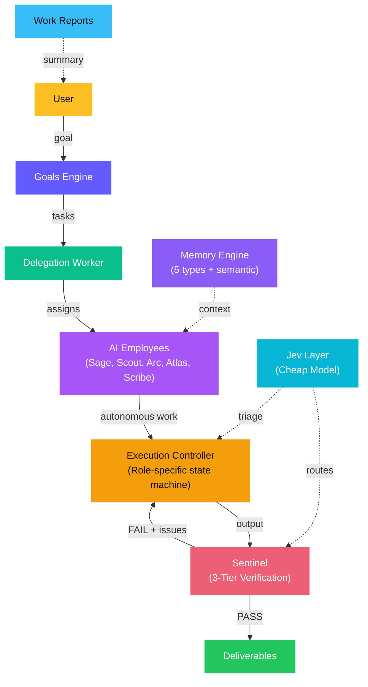

# ARIA — AI Software Company

> **Persistent AI employees that work autonomously with guaranteed output quality.**

---

> [!status] System Status
> | Metric | Value |
> |--------|-------|
> | **Version** | v3.0 (Autonomous Execution Runtime) |
> | **Core Thesis** | Agent Output Quality Assurance — [[Core Thesis]] |
> | **Frontend** | [Vercel](https://ai-software-company-gold.vercel.app) — auto-deploy |
> | **Backend** | Railway (app + Redis + Postgres) — auto-deploy |
> | **Employees** | 6 roles: Sage, Scout, Arc, Atlas, Sentinel, Scribe |
> | **Execution** | Durable worker + 3-tier Sentinel + Jev routing |

---

## The Thesis

> [!decision] Why ARIA Exists
> **"You wouldn't let a junior developer ship code without code review. Why do you let AI do it?"**
>
> Every AI tool today — Cursor, Replit, Lovable — has the builder grading its own exam. ARIA is the only platform with **independent multi-agent verification** that catches what single-agent systems miss.
>
> See [[Core Thesis]] for the full strategic argument.

---

## Command Center

### Strategy & Vision

| Document | Description |
|----------|-------------|
| [[Core Thesis]] | Why ARIA exists — the undeniable positioning |
| [[Project Vision]] | Original vision and evolution |
| [[Roadmap]] | V1-V5 roadmap with current status |

### Architecture (Current — V3)

| Document | Description |
|----------|-------------|
| [[Tech Stack]] | Python FastAPI + Next.js + PostgreSQL + Redis |
| [[Model Strategy]] | Jev layer (cheap routing) + Smart models (creative work) |
| [[Six Agent Architecture]] | Why 6 agents, not 1 |

### AI Employees

| Role | Name | Focus |
|------|------|-------|
| Business Analyst | **Sage** | Requirements, stakeholder analysis |
| Researcher | **Scout** | Web research, competitive analysis |
| Architect | **Arc** | System design, tech stack decisions |
| Software Engineer | **Atlas** | Code generation, implementation |
| QA Engineer | **Sentinel** | 3-tier independent verification |
| Technical Writer | **Scribe** | Documentation, reports |

### Key Systems

| System | Description |
|--------|-------------|
| **Execution Controller** | Policy-driven state machine per employee role |
| **Execution Worker** | Durable Redis-backed autonomous processing |
| **Multi-Tier Sentinel** | Structural → Deep → Domain verification (fail-fast) |
| **Jev Decision Layer** | Cheap model for routing/QA, expensive for creative |
| **Goals Engine** | Decompose objectives into task graphs |
| **Memory Engine** | 5 memory types with consolidation and semantic search |
| **Work Reports** | "While You Were Away" execution summaries |

### Decisions & History

| Document | Description |
|----------|-------------|
| [[Cross Review System]] | Why agents review each other |
| [[Search API Comparison]] | Why Tavily over DuckDuckGo |
| [[Approval Gate Design]] | Why founder stays in control |

### Knowledge Base

| Document | Description |
|----------|-------------|
| [[Agentic AI - Master Guide]] | Complete agentic AI overview |
| [[Multi-Agent Architectures]] | Orchestrator, hierarchical, swarm, pipeline |
| [[Agent Frameworks Comparison]] | LangGraph vs CrewAI vs OpenAI SDK vs Claude SDK |
| [[AI Agent Market - Competitors]] | Cognition, Sierra, Harvey — who's earning what |

---

## Architecture Overview

```mermaid
graph TB
    U["User"] -->|goal| GE["Goals Engine"]
    GE -->|tasks| D["Delegation Worker"]
    D -->|assigns| EMP["AI Employees<br/>(Sage, Scout, Arc, Atlas, Scribe)"]
    EMP -->|autonomous work| EC["Execution Controller<br/>(Role-specific state machine)"]
    EC -->|output| SEN["Sentinel<br/>(3-Tier Verification)"]
    
    SEN -->|PASS| DEL["Deliverables"]
    SEN -->|FAIL + issues| EC
    
    JEV["Jev Layer<br/>(Cheap Model)"] -.->|routes| SEN
    JEV -.->|triage| EC
    
    MEM["Memory Engine<br/>(5 types + semantic)"] -.->|context| EMP
    WR["Work Reports"] -.->|summary| U
    
    style U fill:#fbbf24,stroke:#fbbf24,color:#0f0f14
    style GE fill:#635bff,stroke:#635bff,color:#fff
    style D fill:#0bbf8c,stroke:#0bbf8c,color:#fff
    style EMP fill:#a855f7,stroke:#a855f7,color:#fff
    style EC fill:#f59e0b,stroke:#f59e0b,color:#0f0f14
    style SEN fill:#ed5f74,stroke:#ed5f74,color:#fff
    style JEV fill:#06b6d4,stroke:#06b6d4,color:#fff
    style DEL fill:#22c55e,stroke:#22c55e,color:#fff
    style MEM fill:#8b5cf6,stroke:#8b5cf6,color:#fff
    style WR fill:#38bdf8,stroke:#38bdf8,color:#0f0f14
```

---

## Quick Stats

> [!agent] The Platform
> | Stat | Count |
> |------|-------|
> | **AI Employees** | 6 persistent roles |
> | **Execution Phases** | 21 (role-specific state machines) |
> | **Sentinel Tiers** | 3 (Structural → Deep → Domain) |
> | **Memory Types** | 5 (core, episodic, procedural, semantic, working) |
> | **LLM Providers** | 5 (NVIDIA, Groq, Bytez, OpenRouter + fallbacks) |
> | **Model Roles** | 10 (per-employee + jev + qa) |

---

## Design Principles

> [!decision] Non-Negotiable
> 1. **6 agents, never fewer** — separation of concerns IS the value
> 2. **Independent verification** — builder never grades its own work
> 3. **Quality over speed** — we're not the fastest, we're the most reliable
> 4. **Build for yourself** — your tool, not a demo

---

*Built by Solo Founder + Claude (CTO)*

#home #dashboard
